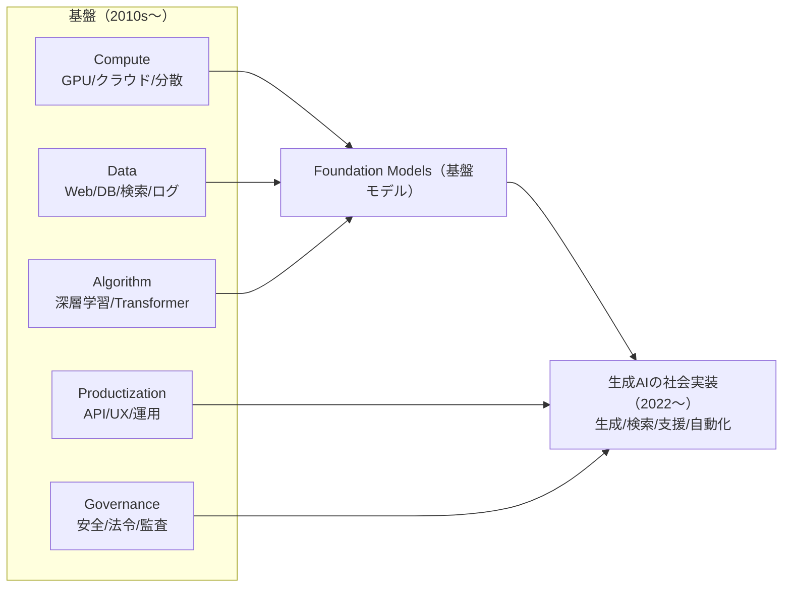

# 付録D：AI時代形成の統合図（Compute×Data×Algorithm×Productization×Governance）



本書は人物史として章が独立している一方で、読者が「AI時代が“突然”成立したのではなく、複数の基盤が収束して成立した」ことを因果で理解するには、横串の地図が必要になる。

この付録では、AI時代形成を **Compute / Data / Algorithm / Productization（+Distribution） / Governance** の収束として捉え、年表（付録A）と各章を対応付ける。

## 1. 5要素モデル（最小定義）

|要素|最小定義（本書での意味）|典型的な論点|
|---|---|---|
|Compute|学習・推論を成立させる計算資源（GPU、クラウド、分散処理）|コスト、スケール、可観測性、運用|
|Data|学習・評価・運用に必要なデータ基盤（DB、Web、検索、ログ）|品質、偏り、権利、データガバナンス|
|Algorithm|モデルと学習法（深層学習、Transformer、最適化）|性能、汎化、推論、解釈可能性|
|Productization (+Distribution)|プロダクトに落とす仕組み（API、UX、統合、SLO、監視）|提供形態、導入障壁、失敗モード|
|Governance|安全・法令・倫理・監査（規制、セキュリティ、説明責任）|誤用、漏えい、責任分界、規制対応|

## 2. 収束の因果（Mermaid 図）

以下は「どの基盤が揃うと社会実装が加速するか」を示す最小の因果図である（年号の詳細は付録A、一次情報は付録Cを参照）。

注記:
- **Foundation Models（基盤モデル）**は、巨大モデルを指す“モデルサイズ”の話ではなく、**多用途に転用される学習済みモデル**という性質を指す（モデルの詳細が非公開の場合は、出典に基づき「非公開」と明記する）。
- Mermaid は環境によってレンダリングされないことがある。必要に応じて GitHub の Markdown 表示や Mermaid Live Editor 等で確認する。

## 3. マイルストーン（要素別の最小セット）

付録Aの年表を、5要素モデルで読めるように“要素別”に圧縮した（ここでは代表例のみ）。

|要素|マイルストーン（例）|対応する章（例）|
|---|---|---|
|Compute|クラウド普及、GPU計算の一般化、分散処理の成熟|第13章（Linux）、第14章（分散）|
|Data|Web/検索の普及、関係DB、ログ/観測の標準化|第6章（Web）、第7章（DB）、第9章（HCI/道具化）|
|Algorithm|深層学習の実用化、Transformerの普及、生成AIの社会実装|第16章（深層学習の技術史）、第10章（現代AIの社会実装）|
|Productization|API提供、統合（ツール呼び出し等）、評価（Evals）とガードレール|第10章（現代AIの社会実装）、第5章（PC/UX）|
|Governance|セキュリティ/暗号、規制（AI Act等）、監査・責任分界|第8章（暗号）、付録A（年表）、付録C（出典）|

## 4. 章→AIスタック対応（本書内マッピング）

本書の人物史を「AI時代形成のどの層に効いたか」で読むための対応表である。各章を“AIの前提条件”として位置付けて読むと、点が線になる。

|章|主題|AI時代形成の要素|接続の要点（1行）|
|---|---|---|---|
|[第11章]({{ "/chapters/chapter11/" | relative_url }})|Web|Data / Distribution|Webはデータと流通の標準化を進め、学習・運用の土台を作った|
|[第7章]({{ "/chapters/chapter07/" | relative_url }})|データベース|Data|DBは“整理されたデータ”と“問い合わせ”を可能にし、再現性を上げた|
|[第8章]({{ "/chapters/chapter08/" | relative_url }})|暗号|Governance|暗号と認証は、AIサービスの安全な流通と責任分界の前提になる|
|[第9章]({{ "/chapters/chapter09/" | relative_url }})|HCI（道具化）|Productization|人間の作業を拡張するUI/ワークフロー設計は、AI導入の成否を左右する|
|[第13章]({{ "/chapters/chapter13/" | relative_url }})|Linux|Compute / Productization|標準OSはクラウド/運用の共通基盤となり、スケールの前提を作った|
|[第14章]({{ "/chapters/chapter14/" | relative_url }})|分散システム|Compute / Productization|分散合意・信頼性は大規模運用の前提であり、AI提供形態に直結する|
|[第16章]({{ "/chapters/chapter16/" | relative_url }})|深層学習の技術史|Algorithm|深層学習の学習法と表現学習が、生成AIのアルゴリズム基盤を作った|
|[第10章]({{ "/chapters/chapter10/" | relative_url }})|現代AIの社会実装|Productization / Governance|ツール統合・評価・規制対応が揃って初めて業務へ定着する|

## 5. 読み方（AI時代形成を最短で掴む）

「AI時代の形成」を因果で押さえたい場合は、次の順が最短である。

1. 付録D（本付録）で地図を掴む
2. 付録A（年表）で主要イベントの位置関係を確認する
3. 第16章（アルゴリズム基盤）→第10章（社会実装）を読む
4. データ/運用/ガバナンスの章（第6/7/8/13/14章）を必要に応じて補完する

注記: 第16章はヒントンを軸にした深層学習の技術史、第10章は現代AIの製品化・運用・規制対応という役割分担で読むと位置づけが整理しやすい。

### 1800年代
- **1815年** エイダ・ラブレス誕生, 309
- **1843年** Note G発表, 309
- **1852年** エイダ・ラブレス死去, 309

### 1900〜1940年代
- **1912年** チューリング誕生, 310
- **1936年** チューリングマシン提案, 310
- **1943年** コロッサス運用開始, 310
- **1945年** ENIAC完成, 310

### 1950年代
- **1950年** チューリングテスト提案, 311
- **1952年** A-0システム開発, 311
- **1954年** チューリング死去, 311
- **1955年** ジョブズ・ウォズニアック誕生, 311

### 1960年代
- **1960年** COBOL標準化, 311
- **1969年** ARPANET開始, 311

### 1970年代
- **1971年** Intel 4004発表, 311
- **1976年** Apple Computer設立, 311
- **1977年** Apple II発表, 311

### 1980年代
- **1981年** IBM PC発表, 311
- **1984年** Macintosh発表, 311
- **1989年** World Wide Web構想, 311

### 1990年代
- **1991年** Web一般公開, 312
- **1994年** Amazon設立, 312
- **1996年** BackRubプロジェクト開始, 312
- **1998年** Google設立, 312

### 2000年代
- **2004年** Facebook開始, 312
- **2006年** AWS開始, 312
- **2007年** iPhone発表, 312

### 2010年代
- **2012年** AlexNet革命, 312
- **2016年** AlphaGo勝利, 312
- **2019年** 量子超越性実証, 312

### 2020年代
- **2020年** GPT-3発表, 312
- **2022年** ChatGPT公開, 312
- **2023年** GPT-4発表, 312

この付録は、人物史と技術潮流を AI 時代形成の観点で読み直すための補助地図です。ページ番号は架空のものですが、実際の書籍では対応箇所を参照できるように整備されます。
