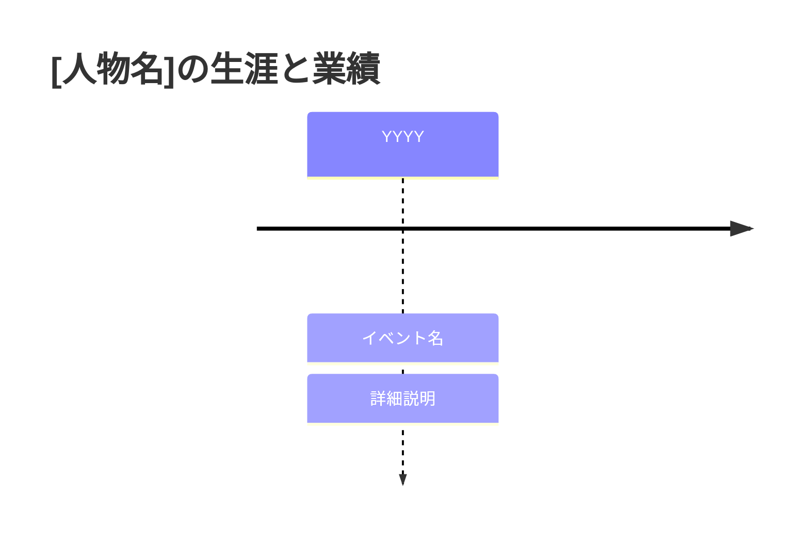
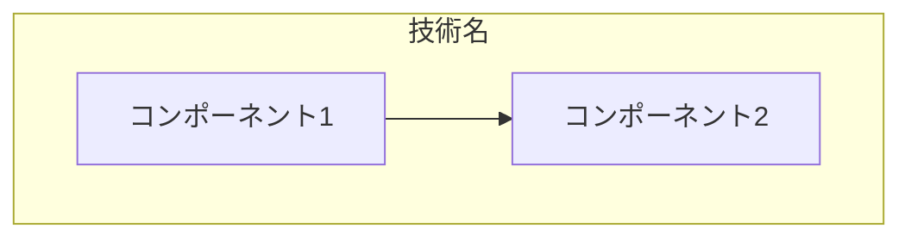
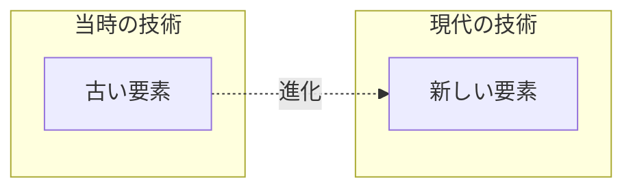
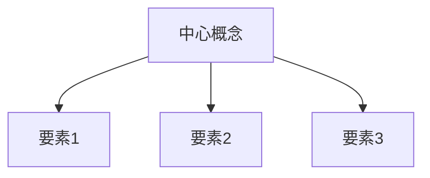

# 章改善テンプレート

## 各章に追加すべき要素

### 1. 冒頭部分
- タイムライン図（Mermaid）で人物の生涯を視覚化

### 2. 本文中
- 史実と創作の区別を明確化
  - 創作的対話には「（※この対話は史実に基づく再構成です）」を追加
  - 引用には脚注番号を付与

### 3. 技術解説コラム
各章の最後に以下の形式で追加：

```markdown
## 技術解説コラム：[技術名]

### 基本構造/原理
- 技術の基本的な仕組みの説明
- 図解（Mermaid）による視覚化

### 現代技術との比較
- 当時の技術と現代技術の対比表
- 技術発展の系譜図

### 革新性の分析
- なぜその技術が革新的だったのか
- 技術史における位置づけ
```

### 4. 現代ビジネスへの教訓
```markdown
## 現代ビジネスへの教訓

### 1. [教訓のタイトル]
**[人物名]の例**: 
- 具体的な事例や行動
- その結果や影響

**現代への応用**:
- ビジネスシーンでの活用方法
- 具体的な適用例
- 期待される効果

### 2. [教訓のタイトル]
（同様の構造で2-3個）
```

### 5. 参考文献
```markdown
## 参考文献

### 一次資料
1. [著者名] (年). 『書名』. 出版社.

### 二次資料・伝記
1. [著者名] (年). 『書名』. 出版社.

### 学術論文
1. [著者名] (年). "論文タイトル". 『雑誌名』, 巻(号), pp.xx-xx.

### Web資料
1. [組織名]. "記事タイトル". URL (最終アクセス日: YYYY-MM-DD)

### 脚注
[^1]: 詳細な引用情報
```

## 図表の種類と用途

### 1. タイムライン（人物の生涯）


### 2. 技術構造図


### 3. 比較図


### 4. 概念関係図


## 文体統一のガイドライン

### 基本ルール
1. 「である調」で統一
2. 読み物として魅力的な描写を維持
3. 技術用語は初出時に説明を付加
4. 専門用語の後には必要に応じて英語表記を併記

### 避けるべき表現
- 「〜だと思われる」→「〜と考えられる」
- 「〜かもしれない」→「〜の可能性がある」
- 口語的表現は創作的対話部分のみに限定

### 推奨する表現
- 断定的な事実：「〜である」「〜だった」
- 推測・解釈：「〜と考えられる」「〜とされている」
- 引用：「〜によれば」「〜と述べている」