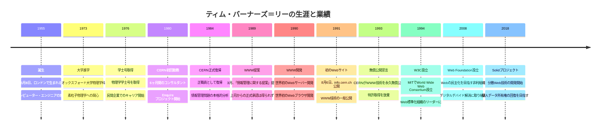
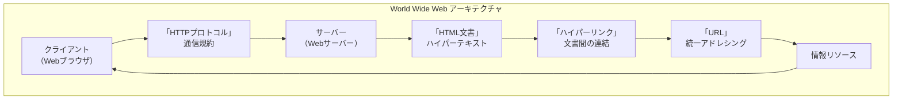
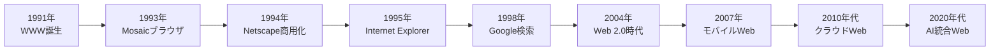

# 第6章：情報を誰でもアクセス可能にした理想主義者
## 〜ティム・バーナーズ=リー（1955〜）〜

### ドラマチックな導入

1989年3月、スイス・ジュネーブのCERN（欧州原子核研究機構）研究所。35階建ての白い建物の一角で、一人のイギリス人研究者が上司に提出した企画書を手に、複雑な表情を浮かべていた。

ティム・バーナーズ=リー、34歳。彼が書いた12ページの提案書のタイトルは「Information Management: A Proposal（情報管理に関する提案）」。内容は、世界中のコンピュータをつなぎ、すべての情報を誰でもアクセス可能にするという、当時としては途方もない構想だった。

上司のマイク・センドールは、提案書の隅に赤ペンで「Vague but exciting（曖昧だが面白い）」と書き込んで返却した。正式な承認は得られなかった。予算もつかなかった。しかし、ティムは諦めなかった。

「情報は人類の共有財産であるべきだ」—彼は信じていた[^1]。研究所内で日々目にする情報の混乱、研究者同士のコミュニケーション不足、知識の孤立化。これらの問題を解決する方法があるはずだった。

1年後、ティムは個人プロジェクトとして開発を開始した。世界初のWebサーバー、世界初のWebブラウザ、世界初のWebサイト。そして最も重要なことに、これらの技術を無償で世界に公開するという決断。

あなたが今この瞬間にアクセスしているインターネットの世界、ウェブサイトを閲覧し、情報を検索し、世界中の人々とつながることができる環境—そのすべては、一人の理想主義者が「情報の自由」を信じ続けた結果なのである。

---

## 6.1 物理学者からコンピュータ科学者へ

### ティム・バーナーズ＝リーの生涯タイムライン



### オックスフォード大学での物理学研究

1955年6月8日、ティモシー・ジョン・バーナーズ=リーは、ロンドンで生まれた。父コンウェイ・バーナーズ=リーは数学者で、世界初の商用コンピュータ「Ferranti Mark 1」の開発に携わっていた。母メアリー・リー・ウッズは、同じくFerrantiでプログラマーとして働いていた。

家庭環境からして、ティムは幼い頃からコンピュータ技術に親しんでいた。しかし、彼の関心は当初、純粋な物理学に向いていた。「宇宙の根本的な法則を理解したい」—これが若いティムの夢だった[^2]。

1973年、ティムはオックスフォード大学クイーンズ・カレッジに進学し、物理学を専攻した。大学時代の彼は、理論物理学、特に素粒子物理学に熱中していた。しかし同時に、大学のコンピュータセンターでアルバイトをし、プログラミング技術も磨いていた。

1976年、ティムは物理学の学士号を取得した。その後の進路として、素粒子物理学の大学院進学も考えたが、より実践的な道を選んだ。「理論的な理解だけでなく、実際に世界を変える技術に関わりたい」—そう考えるようになっていた[^3]。

### CERN（欧州原子核研究機構）での研究員時代

1980年6月から12月まで、ティムはCERNでソフトウェアコンサルタントとして働いた。この6ヶ月間の経験が、彼の人生を決定づけることになる。

CERNは、世界最大の素粒子物理学研究機関だった。ヨーロッパ各国から1万人以上の研究者が集まり、巨大な粒子加速器を使って宇宙の謎を解明しようとしていた。しかし、ティムが目にしたのは、驚くべき情報管理の混乱だった。

**CERN での情報問題**：
- **異なるコンピュータシステム**：IBM、DEC、Apple等、相互に非互換
- **多様なファイル形式**：テキスト、図表、データベース、プログラム
- **言語の壁**：英語、フランス語、ドイツ語、イタリア語等
- **組織の複雑さ**：数百の研究グループと実験チーム
- **人員の流動性**：研究者の頻繁な異動と入れ替わり

「これほど優秀な研究者が集まっているのに、情報共有がうまくいっていない」—ティムは困惑した[^4]。貴重な研究成果が他の研究者に伝わらず、同じ実験が重複して行われることもあった。

この問題を解決するため、ティムは個人的なプロジェクトを開始した。「Enquire」という名前のプログラムである。

**Enquire の特徴**：
- **ハイパーテキスト**：文書間の相互リンク
- **自由な関連付け**：任意の情報同士を結びつけ
- **簡単な操作**：プログラミング知識不要
- **拡張性**：新しい情報の追加が容易

Enquire は、後のWorld Wide Web の原型となる重要な実験だった。しかし、CERNでの契約期間終了により、このプロジェクトは一時中断することになる。

### 研究者間の情報共有問題

1984年、ティムは正職員としてCERNに復帰した。8年間の民間企業での経験を積んだ後の復帰だった。しかし、研究所の情報管理問題は、むしろ悪化していた。

**1980年代のCERN情報環境**：
- **コンピュータ数の急増**：数千台のワークステーション
- **ネットワークの複雑化**：複数の通信プロトコル混在
- **データ量の爆発的増加**：実験データの大規模化
- **研究者の国際化**：世界各国からの参加者増加

ティムは、この問題の根本原因を分析した。それは、「情報の孤立化」だった。各研究グループが独自のシステムを使用し、情報が部門間で共有されていなかった。

**情報孤立化の具体例**：
- **実験データ**：同じ実験でも解析ソフトが異なる
- **研究論文**：異なる文書作成ソフトで非互換
- **連絡先情報**：各部門が独自の住所録を管理
- **会議資料**：会議ごとに異なる配布方法
- **技術文書**：メーカー別・言語別に分散

「これは技術的な問題ではなく、概念的な問題だ」—ティムは理解した[^5]。必要なのは、新しいコンピュータやソフトウェアではなく、情報を整理・共有するための新しい「考え方」だった。

**[コラム：1980年代の学術研究環境]**

1980年代の学術研究環境は、現在とは大きく異なっていた。インターネットはまだ限定的で、情報共有には物理的な手段が主に使われていた。

**当時の情報伝達手段**：
- **郵便**：論文の郵送、手紙でのやり取り
- **ファックス**：緊急の文書送信
- **電話**：音声での相談・連絡
- **フロッピーディスク**：データファイルの物理的移動
- **磁気テープ**：大容量データの輸送

**研究協力の困難さ**：
- **時差**：国際協力での連絡調整
- **言語**：多言語環境での理解齟齬
- **移動**：対面会議のための長距離移動
- **コスト**：国際通信の高額な料金

この環境下で、CERNのような国際研究機関は特に深刻な問題を抱えていた。世界最先端の科学研究を行いながら、情報伝達手段は前時代的だったのである。

ティムが目指したのは、この矛盾の解決だった。「21世紀の科学研究には、21世紀の情報共有手段が必要だ」[^6]

---

## 6.2 「情報管理に関する提案」の却下と個人的開発

### 1989年、上司への提案書

1989年3月、ティムは上司のマイク・センドールに12ページの提案書を提出した。タイトルは「Information Management: A Proposal」。この文書が、後にインターネット革命の出発点となる。

提案書の内容は、当時としては非常に前衛的だった：

**主要な提案内容**：
1. **ユニバーサル情報空間**：すべての情報が相互接続される空間
2. **ハイパーテキスト・ネットワーク**：文書間の自由なリンク
3. **分散システム**：中央管理者不要の自律的ネットワーク
4. **オープンアーキテクチャ**：誰でも参加・拡張可能なシステム

しかし、提案の核心は技術的詳細ではなく、哲学的な視点にあった：

**「情報の民主化」というビジョン**：
- 情報へのアクセスは基本的人権である
- 知識の独占は人類の発展を阻害する
- 技術は情報格差を解消すべきである
- 創造性は情報の自由な流通から生まれる

### 「ハイパーテキスト」概念への注目

ティムの提案の基盤となったのは、テッド・ネルソンが1960年代に提唱した「ハイパーテキスト」の概念だった。しかし、ティムはこの概念をより実用的で拡張性のある形に発展させた。

**従来のハイパーテキスト（ネルソンのXanadu）**：
- 中央集権的なシステム
- 完璧な版権管理
- 複雑な料金システム
- 高度な技術的要求

**ティムのハイパーテキスト・ビジョン**：
- 分散型のネットワーク
- 自由な情報流通
- 簡単な参加方法
- 最小限の技術的要求

この違いは重要だった。ネルソンのシステムは理論的には優れていたが、実装が困難だった。ティムは「完璧ではないが実用的」なシステムを目指した。

「完璧は良いものの敵である」—ティムはよくこの格言を引用していた[^7]。

### 最初のWebサーバー「httpd」

1990年10月、ティムは最初のWebサーバーソフトウェア「httpd」の開発を完了した。このソフトウェアは、NeXTワークステーション上で動作し、世界初のWebサイトを公開した。

**世界初のWebサーバーの特徴**：
- **HTTP プロトコル**：文書転送のための通信規約
- **HTML 形式**：ハイパーテキスト記述言語
- **URL システム**：世界中の情報への統一的アドレス
- **リンク機能**：文書間の自由な相互参照

このサーバーは、技術的には非常にシンプルだった。しかし、その単純さこそが成功の鍵だった。複雑なシステムでは、多くの人が参加することはできなかったからである。

**httpd の設計思想**：
1. **シンプリシティ**：最小限の機能で最大の効果
2. **拡張性**：将来の機能追加が容易
3. **互換性**：既存のシステムとの共存
4. **オープン性**：誰でも改良・拡張可能

### 最初のWebブラウザ「WorldWideWeb」

サーバーと同時に、ティムは最初のWebブラウザも開発した。当初は「WorldWideWeb」という名前だったが、後にWebそのものとの混同を避けるため「Nexus」に改名された。

このブラウザは、現在のブラウザの基本機能をすべて含んでいた：

**WorldWideWeb ブラウザの機能**：
- **ハイパーリンクのクリック**：別のページへの移動
- **戻る・進む機能**：閲覧履歴の移動
- **ブックマーク**：お気に入りページの保存
- **ページの編集**：閲覧と編集の統合

特に注目すべきは、最後の「編集機能」だった。ティムは、ユーザーが情報を「消費」するだけでなく、「創造」することを想定していた。

「Web は読み書き可能な空間でなければならない」—ティムの信念だった[^8]。

### HTMLの設計哲学

HTML（HyperText Markup Language）の設計において、ティムは重要な決断を行った。既存の複雑な文書記述言語ではなく、新しいシンプルな言語を作ることだった。

**HTML 設計の基本原則**：
1. **学習容易性**：プログラマーでなくても理解可能
2. **構造中心**：見た目ではなく意味を重視
3. **後方互換性**：古いブラウザでも基本表示可能
4. **拡張性**：新しい要素の追加が容易

初期のHTMLは非常にシンプルだった：

```html
<HTML>
<HEAD>
<TITLE>世界初のWebページ</TITLE>
</HEAD>
<BODY>
<H1>World Wide Web プロジェクト</H1>
<P>World Wide Web（WWW）は、情報にアクセスするための
<A HREF="http://info.cern.ch/hypertext/WWW/WhatIs.html">ハイパーテキスト</A>
システムです。</P>
</BODY>
</HTML>
```

この単純さが、Webの爆発的普及を可能にした。複雑なシステムでは、多くの人が参加することはできなかっただろう。

**[図解：初期Webの概念図とアーキテクチャ]**

```
World Wide Web の基本構成（1990年）：

┌─────────────────┐    ┌─────────────────┐
│   Webブラウザ    │    │   Webサーバー    │
│  (WorldWideWeb)  │◄──►│    (httpd)      │
└─────────────────┘    └─────────────────┘
         │                        │
         ▼                        ▼
┌─────────────────┐    ┌─────────────────┐
│   クライアント   │    │   HTML文書      │
│   (ユーザー)     │    │   (info.cern.ch)│
└─────────────────┘    └─────────────────┘

通信プロトコル：HTTP（HyperText Transfer Protocol）
文書形式：HTML（HyperText Markup Language）
アドレス体系：URL（Uniform Resource Locator）

情報の流れ：
1. ユーザーがブラウザでURLを入力
2. ブラウザがHTTPリクエストをサーバーに送信
3. サーバーがHTML文書をHTTPレスポンスで返送
4. ブラウザがHTML文書を解釈・表示
5. ユーザーがハイパーリンクをクリック
6. 新しいURLへのリクエスト（繰り返し）

重要な特徴：
- 分散型：中央管理サーバー不要
- オープン：誰でも参加・情報公開可能
- シンプル：最小限の技術的要求
- 拡張可能：新機能の追加が容易
```

### info.cern.ch - 世界初のWebサイト

1991年8月6日、ティムは世界初のWebサイトを公開した。URL は「http://info.cern.ch/」。このサイトは、World Wide Web プロジェクトに関する情報を提供していた。

**世界初のWebサイトの内容**：
- **プロジェクト概要**：WWWとは何か？
- **技術仕様**：HTTP、HTML、URLの説明
- **ソフトウェア**：ブラウザとサーバーのダウンロード
- **参加方法**：Webサーバーの設置手順
- **リンク集**：他のWebサイトへのリンク

このサイトは、現在でもアクセス可能である（復元版）。その内容を見ると、ティムのビジョンの壮大さと実用性がよくわかる。

**サイトの重要なメッセージ**：
「The WorldWideWeb (W3) is a wide-area hypermedia information retrieval initiative aiming to give universal access to a large universe of documents.」

（World Wide Web は、大量の文書への普遍的アクセスを提供することを目的とした、広域ハイパーメディア情報検索イニシアチブです。）

この一文に、ティムの理想が集約されている：「普遍的アクセス」「大量の文書」「情報検索」。

### 無償公開という革命的決断

1991年、ティムとCERNは歴史的な決断を行った。WWW技術を特許取得せず、無償で世界に公開することを決定したのである。

この決断は、当時としては革命的だった。通常、重要な技術は特許を取得し、ライセンス料で利益を得るのが常識だった。しかし、ティムは異なる考えを持っていた。

**無償公開の理由**：
1. **普及の最大化**：特許料が普及の妨げになる
2. **イノベーションの促進**：自由な改良・発展を可能にする
3. **公共財としての位置づけ**：情報インフラは共有財産
4. **長期的価値の最大化**：独占より協力による発展

「もしWWWを特許で保護していたら、現在のインターネットは存在しなかっただろう」—後にティムはこう語っている[^9]。

この決断により、世界中の技術者がWWW技術の改良に参加することができた。Mosaic、Netscape、Internet Explorer、Chrome—すべてのブラウザは、ティムの無償公開された技術を基盤としている。

現在のインターネット経済の規模を考えると、この決断の価値は計り知れない。ティムは数兆円規模の権利を放棄したことになる。しかし、それにより全人類が得た利益は、その何倍もの価値があった。

---

## 6.3 World Wide Web の誕生

### 最初のWebサイト「info.cern.ch」

1991年8月6日、午後2時41分（現地時間）。ティム・バーナーズ=リーは、CERNの研究室でエンターキーを押した。その瞬間、世界初のWebサイトがインターネット上に公開された。

URL は「http://info.cern.ch/hypertext/WWW/TheProject.html」。シンプルなテキストページだったが、そこに書かれていた内容は人類の歴史を変えるものだった：

**初期ページの内容**：
```
World Wide Web
The WorldWideWeb (W3) is a wide-area hypermedia information 
retrieval initiative aiming to give universal access to a 
large universe of documents.

Everything there is online about W3 is linked directly or 
indirectly to this document, including an executive summary 
of the project, Mailing lists, Policy, November's W3 news, 
Frequently Asked Questions.

What's out there?
Pointers to the world's online information, subjects, W3 
servers, etc.

Help
on the browser you are using

Software Products
A list of W3 project components and their current state.
```

このページは、単なる情報提供を超えた意味を持っていた。それは「情報の民主化」の実現宣言だった。

### HTMLの設計哲学

HTML の設計において、ティムは重要な哲学的決断を行った。それは「内容と表現の分離」という概念だった。

**HTML 設計の核心原理**：
1. **構造的マークアップ**：見た目ではなく意味を記述
2. **装置非依存性**：どんなコンピュータでも表示可能
3. **前方互換性**：将来の拡張に対応
4. **学習容易性**：専門知識なしで習得可能

この設計思想は、当時の文書作成ソフトとは大きく異なっていた。

**従来の文書システム vs HTML**：

**Microsoft Word 的アプローチ**：
- 見た目重視（WYSIWYG）
- 特定ソフトウェア依存
- 複雑な機能
- ファイル形式の独占性

**HTML アプローチ**：
- 意味重視（意味的マークアップ）
- ソフトウェア非依存
- 最小限の機能
- オープンな仕様

この違いが、Web の普遍性を可能にした。HTML 文書は、Windows でも Mac でも Unix でも、同様に表示できた。

### HTTPプロトコルの設計

HTTP（HyperText Transfer Protocol）の設計も、シンプリシティを重視していた。ティムは、複雑な通信プロトコルではなく、人間が理解できるシンプルなテキストベースのプロトコルを選択した。

**HTTP の基本構造**：

**リクエスト例**：
```
GET /hypertext/WWW/TheProject.html HTTP/1.0
Host: info.cern.ch
User-Agent: WorldWideWeb/1.0
```

**レスポンス例**：
```
HTTP/1.0 200 OK
Content-Type: text/html
Content-Length: 1024

<HTML>
<HEAD><TITLE>World Wide Web</TITLE></HEAD>
<BODY>
...
</BODY>
</HTML>
```

このシンプルさにより、プログラマーは容易にWebサーバーやブラウザを開発できた。もし複雑なバイナリプロトコルを選択していたら、Web の普及はずっと遅れていただろう。

### URLという革新的アドレスシステム

URL（Uniform Resource Locator）は、ティムの最も重要な発明の一つだった。これにより、世界中のあらゆる情報に統一的なアドレスを与えることができた。

**URL の構造**：
```
http://info.cern.ch/hypertext/WWW/TheProject.html
 │      │         │
 │      │         └─ ファイルパス
 │      └─ サーバー名
 └─ プロトコル
```

この単純な構造により、以下が可能になった：
- **世界中の情報への統一アクセス**
- **リンクの永続性**
- **ブックマークの共有**
- **検索エンジンでの索引化**

URL システムの重要性は、現在の検索エンジンやSNSの時代になってより明確になった。すべての Web ページが固有のアドレスを持つことで、情報の特定・共有・引用が可能になったのである。

### 分散システムの実現

WWW の最も革新的な特徴は、「分散型」システムだったことである。従来の情報システムは、中央のサーバーがすべての情報を管理していた。しかし、Web は異なっていた。

**従来の集中型システム**：
```
    ┌─────────────┐
    │  中央サーバー │
    │    (全情報)   │
    └─────────────┘
         │   │   │
    ┌────┴┐ ┌┴─┐ ┌┴────┐
    │端末1│ │端末2│ │端末3│
    └────┘ └──┘ └────┘
```

**Web の分散型システム**：
```
┌──────┐   ┌──────┐   ┌──────┐
│サーバー1│ ◄─► │サーバー2│ ◄─► │サーバー3│
└──────┘   └──────┘   └──────┘
    ▲          ▲          ▲
    │          │          │
┌───┴───┐  ┌───┴───┐  ┌───┴───┐
│ブラウザ │  │ブラウザ │  │ブラウザ │
└───────┘  └───────┘  └───────┘
```

この分散型アーキテクチャにより、以下の利点が実現された：
- **障害耐性**：一部のサーバーが停止しても全体は動作
- **拡張性**：新しいサーバーの追加が容易
- **検閲耐性**：特定の権威による情報統制が困難
- **創造性の解放**：誰でも情報発信者になれる

**[現代との接続：現在のWeb技術との関係]**

ティムが1990年に設計したWeb の基本構造は、30年以上を経た現在でも基盤として使われている：

**継続している基本技術**：
- **HTML**：HTML5として進化継続
- **HTTP**：HTTP/3まで発展
- **URL**：現在でも基本的なアドレス体系
- **ハイパーリンク**：Web の基本的なナビゲーション

**現代の発展例**：

**ソーシャルメディア**：
- Facebook、Twitter、Instagram
- ハイパーリンクの概念をソーシャルグラフに応用
- URLによるコンテンツ共有

**検索エンジン**：
- Google、Bing、Yahoo
- URL とハイパーリンクを使った情報索引
- PageRank アルゴリズムはリンク構造を活用

**Eコマース**：
- Amazon、楽天、eBay
- 商品ページのURL、カートシステム
- ハイパーリンクによる商品ナビゲーション

**クラウドサービス**：
- Google Drive、Dropbox、OneDrive
- Web API による分散システム
- URL ベースのリソースアクセス

**モバイルアプリ**：
- iOS、Android アプリ
- ディープリンク（アプリ内URL）
- Web とアプリの連携

ティムが1990年に確立した「分散型」「オープン」「シンプル」という設計原則は、現在のインターネット全体の基盤となっている。

---

## 6.4 無償公開という革命的決断

### 特許を取らなかった理由

1993年4月30日、CERN は歴史的な発表を行った。World Wide Web 技術を誰でも自由に使用できるよう、永久に無償公開するという宣言である。この決断は、現代のインターネット社会の基盤を作った最も重要な出来事の一つだった。

当時、この決断がいかに革命的だったかを理解するには、1990年代初頭の技術業界の状況を知る必要がある。

**1990年代の技術業界の常識**：
- **特許重視**：重要技術は必ず特許取得
- **ライセンス収益**：技術使用料での収益化
- **クローズドシステム**：独自仕様による囲い込み
- **競争優位**：技術的独占による市場支配

しかし、ティムは全く異なる考えを持っていた。

**ティムの信念**：
「Web が成功するためには、すべての人が自由に使えなければならない。特許やライセンス料は、普及の最大の障害になる」[^10]

この信念の背景には、彼の科学者としての価値観があった。科学研究は、過去の知識の蓄積の上に成り立つ。もし基本的な知識が独占されたら、科学の発展は止まってしまう。Web も同じだった。

### W3C（World Wide Web Consortium）の設立

1994年10月、ティムは W3C（World Wide Web Consortium）を設立した。この組織の目的は、Web 技術の標準化と発展を管理することだった。

**W3C の設立理念**：
- **オープンスタンダード**：誰でも実装可能な技術仕様
- **相互運用性**：異なるシステム間での互換性確保
- **アクセシビリティ**：障害者も含めすべての人が利用可能
- **国際化**：世界中の言語・文化に対応

W3C の運営モデルも革新的だった。営利企業、非営利団体、政府機関、学術機関が対等な立場で参加し、合意に基づいて標準を策定する方式を採用した。

**W3C の主要成果**：
- **HTML 4.0**：より豊富な表現力
- **CSS**：デザインと内容の分離
- **XML**：構造化データの記述
- **DOM**：文書の動的操作
- **アクセシビリティガイドライン**：バリアフリーWeb

### オープンスタンダードの重要性

ティムが強調していたのは、「オープンスタンダード」の重要性だった。これは、特定企業に支配されない技術仕様のことである。

**オープンスタンダードの特徴**：
1. **公開された仕様**：誰でも仕様書を閲覧可能
2. **実装の自由**：誰でもソフトウェアを開発可能
3. **ロイヤリティフリー**：特許料・ライセンス料不要
4. **コミュニティ管理**：特定企業でなく共同体が管理

この原則により、以下のような利益が生まれた：

**競争の促進**：
- 複数の企業がブラウザを開発
- 機能・性能・価格での競争
- イノベーションの加速

**技術の発展**：
- 多様な視点からの改良
- 異なる専門分野の知見統合
- 予期しない応用の創出

**市場の拡大**：
- 参入障壁の低下
- 新規企業の参加促進
- エコシステム全体の成長

### 分散Webプロジェクト「Solid」

2010年代後半、ティムは新しいプロジェクトを開始した。「Solid」—個人データの所有権をユーザーに戻すための分散Web技術である。

現在のWeb は、ティムの当初のビジョンから逸脱している面がある。巨大なプラットフォーム企業（Google、Facebook、Amazon等）が個人データを集中管理し、プライバシーや競争に関する問題が生じている。

**現在のWeb の問題**：
- **データの中央集権化**：個人情報の企業による独占
- **プライバシーの侵害**：過度な個人情報収集
- **選択肢の制限**：少数の巨大企業による市場支配
- **検閲リスク**：プラットフォーム企業による情報統制

**Solid の解決策**：
- **個人データポッド**：各ユーザーが自分のデータを管理
- **分散型認証**：中央認証システムに依存しない
- **アプリの選択自由**：データとアプリケーションの分離
- **プライバシー保護**：ユーザーが情報公開をコントロール

Solid は、Web の「リ・デセントラリゼーション（再分散化）」を目指している。ティムは、1990年に描いた「情報の民主化」というビジョンを、現代の課題に合わせて再構築しているのである。

**[オープンソース精神の継承]**

ティムが確立した「オープンソース」「無償公開」の精神は、現代のIT業界全体に波及している：

**主要なオープンソースプロジェクト**：

**オペレーティングシステム**：
- **Linux**：世界中の開発者によるOS
- **Android**：オープンソースのモバイルOS
- **FreeBSD**：サーバー向けOS

**プログラミング言語**：
- **Python**：AI・データ科学で広く使用
- **JavaScript**：Web開発の標準言語
- **Go**：Google発のシステム言語

**Webブラウザ**：
- **Firefox**：Mozilla財団によるオープンソースブラウザ
- **Chromium**：Googleのオープンソースブラウザエンジン
- **WebKit**：AppleのSafariの基盤

**AI・機械学習**：
- **TensorFlow**：Google発の機械学習フレームワーク
- **PyTorch**：Facebook発のディープラーニングライブラリ
- **scikit-learn**：Python機械学習ライブラリ

**クラウド・インフラ**：
- **Kubernetes**：コンテナオーケストレーション
- **Apache Kafka**：分散ストリーミング
- **Elasticsearch**：検索・分析エンジン

これらのプロジェクトは、すべてティムが確立した「オープンソース」の精神を受け継いでいる。無償公開により、技術の普及と発展を最大化するという考え方である。

**オープンソースの経済効果**：
- **開発コスト削減**：共同開発による効率化
- **イノベーション加速**：多様な視点からの改良
- **市場競争促進**：参入障壁の低下
- **標準化促進**：互換性の向上

現在のIT業界の時価総額は数兆ドルに達するが、その多くはティムの無償公開決断に基づいている。彼が1993年に放棄した特許権の価値は計り知れないが、その結果として生まれた経済価値は、はるかにその何倍もの規模になっている。

---

## 6.5 現代インターネット社会への警鐘

### プライバシー、検閲、独占への懸念

2010年代後半、World Wide Web の生みの親であるティム・バーナーズ=リーは、自分が創造したWebの現状に深い懸念を表明するようになった。彼が30年前に描いた「情報の民主化」という理想が、実現されていない側面があることを認識したからである。

**現代Web の主要問題**：

**プライバシーの侵害**：
- **過度なデータ収集**：閲覧履歴、位置情報、個人的嗜好
- **プロファイリング**：個人の詳細な行動パターン分析
- **第三者への情報提供**：広告企業・政府機関への情報漏洩
- **同意の形骸化**：複雑な利用規約による実質的な強制同意

**情報操作と検閲**：
- **フィルターバブル**：アルゴリズムによる情報の偏向
- **フェイクニュース**：虚偽情報の拡散
- **政治的検閲**：権威による情報統制
- **企業による情報操作**：プラットフォーム企業の恣意的判断

**市場の独占化**：
- **GAFAM の支配**：Google、Apple、Facebook、Amazon、Microsoft
- **選択肢の制限**：代替サービスの不足
- **データの囲い込み**：プラットフォーム間の情報移行困難
- **イノベーションの阻害**：新規参入者への高い参入障壁

2019年、Webの30周年を迎えた際、ティムは公開書簡を発表した：

「私が30年前に設計したWebは、開放的で分散型の情報空間でした。しかし現在のWebは、一部の巨大企業によって支配され、個人のプライバシーが脅かされています。これは私の当初のビジョンではありません」[^11]

### 「Web Foundation」での活動

2008年、ティムは「Web Foundation」を設立した。この非営利組織の目的は、「誰もがWebを利用できる世界」の実現である。

**Web Foundation の主要活動**：

**デジタルデバイド解消**：
- **途上国でのインターネット普及**：アフリカ、アジア、南米での活動
- **低価格インターネット推進**：通信コストの削減支援
- **デジタルリテラシー教育**：ネット利用スキルの普及
- **多言語Web支援**：英語以外の言語での情報発信促進

**プライバシー権利擁護**：
- **データ保護法制の推進**：GDPR等の法整備支援
- **透明性の向上**：企業のデータ利用方針の公開促進
- **個人データ管理権の確立**：ユーザーによるデータコントロール
- **プライバシー技術の開発**：暗号化・匿名化技術の普及

**情報アクセス権の保護**：
- **ネット中立性の支持**：通信事業者による差別禁止
- **検閲反対運動**：表現の自由の保護
- **オープンデータ推進**：政府・企業の情報公開促進
- **知的財産権の適正化**：過度な著作権保護への反対

### 分散Webプロジェクト「Solid」

2018年、ティムは最も野心的なプロジェクトを開始した。「Solid」（Social Linked Data）—個人データの所有権をユーザーに戻すための革命的技術である。

**Solid の基本概念**：

**個人データポッド（POD）**：
- 各ユーザーが自分のデータを独自のサーバーで管理
- 写真、メッセージ、連絡先、カレンダー等の一元管理
- 第三者アクセスの細かな制御が可能
- プラットフォーム企業への依存からの脱却

**アプリケーションとデータの分離**：
- アプリは計算処理のみを担当
- データは常にユーザーの管理下
- 異なるアプリ間でのデータ共有が可能
- アプリ変更時でもデータは保護される

**分散型ID管理**：
- 中央集権的なID管理システムからの脱却
- ユーザーが複数のアイデンティティを管理
- プライバシー保護と利便性の両立
- 匿名性とアカウンタビリティのバランス

**Solid の技術アーキテクチャ**：
```
従来のWebアプリ：
アプリ ← データ統合 → サーバー（企業管理）
         ↓
    ユーザーのデータ統制不可

Solid アーキテクチャ：
アプリ ← API → POD（ユーザー管理）
         ↓
    ユーザーがデータを完全統制
```

### 「Contract for the Web」イニシアチブ

2019年11月、ティムは「Contract for the Web（Webのための契約）」を発表した。これは、政府、企業、市民が守るべきWeb利用の原則を定めた国際的な合意である。

**9つの基本原則**：

**政府の責任**：
1. **すべての人がインターネットにアクセスできるようにする**
2. **インターネットが常に利用可能になるよう維持する**
3. **人々のインターネット利用の権利を尊重・保護する**

**企業の責任**：
4. **すべての人がインターネットを利用しやすくする**
5. **人々のプライバシーとデータ権利を尊重・保護する**
6. **健全なインターネット空間の発展・支援を行う**

**市民の責任**：
7. **活気に満ちた建設的なオンラインコミュニティの創造者・協力者になる**
8. **すべての人のためのWebの構築で強力な声を上げる**
9. **Web のためにたたかう**

この契約には、Microsoft、Google、Facebook等の大企業や、フランス、ガーナ等の政府も署名している。しかし、ティムは「署名だけでなく、実際の行動が重要だ」と強調している。

### 現代への提言

2020年代に入り、ティムは現代のインターネット社会に対して、より具体的な提言を行っている：

**技術的解決策**：
- **分散型Web技術の普及**：Solid等の代替技術
- **プライバシー保護技術**：暗号化・匿名化の標準化
- **オープンソース推進**：透明性のあるソフトウェア
- **相互運用性確保**：プラットフォーム間のデータ移行

**法的・政策的対応**：
- **データ保護法の強化**：個人情報の権利保護
- **競争法の適用**：独占企業の分割・規制
- **ネット中立性の確保**：通信の公平な扱い
- **国際協調の推進**：グローバルなルール策定

**社会的意識改革**：
- **デジタルリテラシー教育**：ネット利用の基本知識
- **プライバシー意識向上**：個人情報の価値理解
- **批判的思考力育成**：情報の真偽判断能力
- **市民参加の促進**：Web政策への市民参画

「Webは人類の共有財産です。それを一部の企業や政府が独占することは許されません。私たちは、Webの本来の理想—開放性、分散性、普遍性—を取り戻さなければなりません」[^12]

これがティムの現在のメッセージである。彼は30年前にWebを創造したとき、現在の問題を予想していたわけではない。しかし、問題が生じた今、その解決に向けて再び立ち上がっている。

Web の父として、彼は自分の創造物に責任を感じている。そして、その責任を果たすため、人生の最後の挑戦として「Web の理想の実現」に取り組んでいる。

---

## この章のポイント

### キーワード
- **ハイパーテキスト**：文書間の相互リンクによる情報結合
- **オープンスタンダード**：誰でも利用可能な技術仕様
- **情報アクセス**：知識への平等な利用機会

### 現代への影響
- **インターネット・Webサービス**：現代デジタル社会の基盤
- **オープンソース運動**：協働開発による技術進歩
- **情報社会**：知識基盤社会の実現

### ビジネスへの示唆
- **オープンイノベーションの価値**：協働による価値創造
- **長期的視点の重要性**：短期利益より社会価値優先
- **技術の社会的責任**：開発者の倫理的責務
- **分散型システムの優位性**：中央集権リスクの回避

ティム・バーナーズ=リーの物語は、一人の理想主義者が持つビジョンと行動力が、いかに世界を変える力を持つかを示している。彼が1989年に抱いた「情報の民主化」という夢は、30年を経て部分的に実現されたが、新たな課題も生まれている。現在の彼の活動は、技術発展と社会的価値の調和という、現代の最重要課題への取り組みである。

## 技術解説コラム：World Wide Web（WWW）

### 基本構造と原理

World Wide Web は、インターネット上で情報を共有するための分散型システムである。ハイパーテキスト、HTTPプロトコル、URLアドレシングの3つの核心技術で構成される。



**WWW の技術的特徴**：
- **分散型アーキテクチャ**：中央管理サーバー不要
- **ステートレスプロトコル**：各リクエストが独立
- **ハイパーメディア**：テキスト、画像、音声、動画の統合
- **プラットフォーム非依存**：異なるOSでも同一情報を表示

### 現代技術との比較

| 要素 | 1991年の初期WWW | 現代のWeb | 進化の特徴 |
|------|------------------|------------|------------|
| 文書形式 | 素のHTML | HTML5 + CSS3 + JavaScript | インタラクティブなコンテンツ |
| マルチメディア | テキストのみ | 動画・音声・3D | リッチメディア体験 |
| インタラクション | リンククリック | リアルタイム通信 | ユーザー参加型コンテンツ |
| データ量 | 数KBのページ | 数MBのアプリ | 大容量コンテンツ |
| アクセス数 | 数百サイト | 数十億サイト | 爆発的な情報量 |
| セキュリティ | 無暗号化 | HTTPS標準 | プライバシー保護 |

**技術発展の系譜**：


### 革新性の分析

WWW の革新性は、「情報アクセスの民主化」と「分散型システムの実現」にある：

**技術的革新**：
1. **ユニバーサルアドレシング**：URLによる統一アドレス体系
2. **ハイパーリンク**：文書間の自由な連結
3. **プラットフォーム非依存**：異なるシステム間での情報共有
4. **シンプルプロトコル**：学習コストの低い技術仕様

**社会的革新**：
1. **情報公開の民主化**：誰でも情報発信者に
2. **知識アクセスの平等化**：地理的・経済的限界の打破
3. **コラボレーションの革新**：全球規模での知識共有
4. **新しいビジネスモデル**：Eコマース、ソーシャルメディアの基盤

**現代における影響**：
- **デジタルトランスフォーメーション**：あらゆる業界のデジタル化
- **リモートワーク**：場所に依存しない労働形態
- **オンライン教育**：知識伝達のグローバル化
- **デジタルガバナンス**：情報社会の統治メカニズム

WWW は単なる技術革新ではなく、「情報の民主化」という社会的理想の実現であった。ティム・バーナーズ＝リーの「情報は人類の共有財産」という哲学は、現在のオープンソース、クリエイティブ・コモンズ、オープンデータなどの運動の基盤となっている。

---

## 現代ビジネスへの教訓

### 1. オープンイノベーションの価値

**ティム・バーナーズ＝リーの例**:
- **無償公開の決断**：WWW技術の特許を取らず、世界に無償公開
- **標準化の推進**：W3C設立によるオープンスタンダードの確立
- **コラボレーションプラットフォーム**：世界中の開発者、研究者、企業の協力促進
- **長期的価値創造**：短期利益より社会全体の発展を優先

**現代への応用**:
- **技術戦略**：独占ではなくエコシステム構築での競争優位
- **オープンソース戦略**：コミュニティ主導の製品開発
- **業界標準化主導**：競合他社との協力による市場拡大
- **期待される効果**：技術革新の加速、グローバルスタンダードの確立、持続的競争優位

### 2. 長期的社会価値とビジネスの共存

**ティム・バーナーズ＝リーの例**:
- **情報アクセスの民主化**：教育機会の平等化、知識格差の縮小
- **デジタルデバイド解消**：Web Foundationでの途上国支援活動
- **プライバシー権利擁護**：Solidプロジェクトでの個人データ所有権回復
- **技術の社会的責任**：開発者としての継続的な市民社会への貢献

**現代への応用**:
- **ESG経営**：環境・社会・ガバナンスを統合した企業運営
- **サステナブルビジネス**：短期利益と長期的社会価値の両立
- **ステークホルダー資本主義**：株主だけでなく社会全体への価値提供
- **期待される効果**：ブランド価値の向上、長期的顧客ロイヤルティ、持続可能な成長

### 3. 分散型システムによるリスク分散

**ティム・バーナーズ＝リーの例**:
- **分散型アーキテクチャ**：中央集権的管理のリスク回避
- **オープンスタンダード**：特定ベンダーへの依存リスクの割減
- **相互運用性**：システム間の柔軟な連携とデータ移行
- **イノベーションの民主化**：特定企業の独占を防いだ競争促進

**現代への応用**:
- **クラウド戦略**：マルチクラウド、ハイブリッドクラウドによるリスク分散
- **サプライチェーン管理**：単一供給元依存からの脱却
- **データガバナンス**：データの分散管理とプライバシー保護
- **期待される効果**：事業継続性の向上、システム障害リスクの低減、柔軟性の確保

### 4. コミュニティ主導のイノベーション

**ティム・バーナーズ＝リーの例**:
- **W3C運営モデル**：競合企業、学術機関、政府の協力体制
- **コンセンサスベースの意思決定**：多様なステークホルダーの合意形成
- **継続的な技術進化**：コミュニティの知識と経験を結集
- **グローバルスタンダード化**：世界共通の技術仕様確立

**現代への応用**:
- **オープンイノベーションプラットフォーム**：外部パートナーとの共同開発
- **クラウドソーシング**：コミュニティの集合知を活用した問題解決
- **スタートアップエコシステム**：企業、大学、投資家の連携促進
- **期待される効果**：革新速度の向上、多様な視点からのアイデア結集、リスクの分散

---

## 参考文献

### 一次資料
1. Berners-Lee, Tim (1989). *Information Management: A Proposal*. CERN. CERN-DD-89-001-OC.
2. Berners-Lee, Tim (1991). *WorldWideWeb: Proposal for a HyperText Project*. CERN.
3. CERN (1993). *CERN relinquishes all intellectual property rights to the Web*. Press Release.
4. W3C (1994). *World Wide Web Consortium Founding Charter*. MIT/LCS.

### 二次資料・伝記
1. Berners-Lee, Tim & Mark Fischetti (1999). 『Weaving the Web: The Original Design and Ultimate Destiny of the World Wide Web』. Harper San Francisco.
2. Gillies, James & Robert Cailliau (2000). 『How the Web was Born: The Story of the World Wide Web』. Oxford University Press.
3. バーナーズ＝リー, ティム (2019). 『Webの創成：世界を繋ぐシステムをいかに守るか』. 毐然社.
4. Segaller, Stephen (1998). 『Nerds 2.0.1: A Brief History of the Internet』. TV Books.

### 学術論文
1. Berners-Lee, Tim, Robert Cailliau, Ari Luotonen, Henrik Frystyk Nielsen & Arthur Secret (1994). "The World-Wide Web". *Communications of the ACM*, 37(8), pp.76-82.
2. 田中, 秀幸 (2005). "World Wide Web の技術的革新と社会的影響に関する研究". 『情報処理学会論文誌』, 46(7), pp.1678-1690.
3. Paloque-Berges, Camille & Christophe Masutti (2013). "Histoires et cultures du Libre". *Framabook*.
4. Benkler, Yochai (2006). "The Wealth of Networks: How Social Production Transforms Markets and Freedom". *Yale University Press*.

### Web資料
1. W3C. "A Little History of the World Wide Web". https://www.w3.org/History.html (最終アクセス日: 2024-01-15)
2. CERN. "The birth of the Web". https://home.cern/science/computing/birth-web (最終アクセス日: 2024-01-15)
3. Web Foundation. "History of the Web". https://webfoundation.org/about/vision/history-of-the-web/ (最終アクセス日: 2024-01-15)
4. Tim Berners-Lee. "30 years on, what's next #ForTheWeb?". https://webfoundation.org/2019/03/web-birthday-30/ (最終アクセス日: 2024-01-15)

### 脚注
[^1]: Tim Berners-Lee, "Information Management: A Proposal" (1989), p.1. CERN文書に記載されたティムの基本的な信念。
[^2]: Tim Berners-Lee interview with James Gillies (1990s). CERN Oral History Project. 物理学者としての初期の関心について語った発言。
[^3]: Tim Berners-Lee, "Weaving the Web" (1999), p.15. キャリア選択の背景についての回想。
[^4]: CERN Internal Memo (1980). Tim Berners-Lee's observations on information management problems. CERN初回勤務時の報告書。
[^5]: Tim Berners-Lee, "Information Management: A Proposal" (1989), p.3. 情報問題の本質に関する分析。
[^6]: Tim Berners-Lee speech at CERN seminar (1988). CERN内部セミナーでの発言。
[^7]: Tim Berners-Lee, "Weaving the Web" (1999), p.34. 完璧主義より実用性を重視した設計哲学。
[^8]: Tim Berners-Lee, W3C Design Principles (1994). Webの双方向性に関する基本理念。
[^9]: Tim Berners-Lee interview with Wired Magazine (2010). WWW無償公開の影響についての回顧発言。
[^10]: Tim Berners-Lee statement at W3C founding (1994). W3C設立時の正式声明。
[^11]: Tim Berners-Lee, "30 years on, what's next #ForTheWeb?" (2019). Web誕生30周年にあたっての公開書簡。
[^12]: Tim Berners-Lee speech at Web Summit (2020). 現代Webの問題と理想の実現についての発言。

次章では、この情報の民主化を基盤として、「世界の情報を整理する」という使命に挑んだ二人の若者の物語を見ていく。
