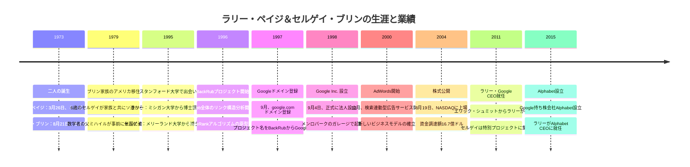
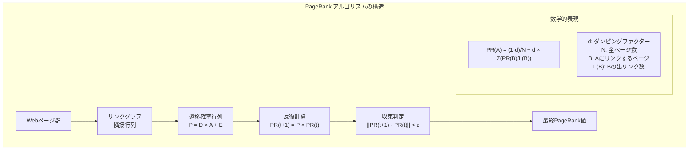
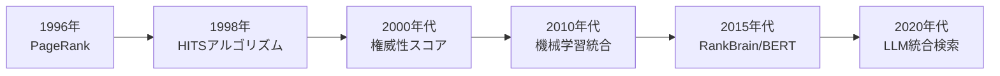

# 第7章：世界の情報を整理する魔法使い
## 〜ラリー・ペイジ（1973〜）&セルゲイ・ブリン（1973〜）〜

### ドラマチックな導入

1996年1月、スタンフォード大学のコンピュータサイエンス棟。深夜のコンピュータラボで、二人の大学院生が激しい議論を交わしていた。一人は金髪のラリー・ペイジ、もう一人は黒髪のセルゲイ・ブリン。テーブルの上には、数百枚のプリントアウトされたWebページが散乱していた。

「Web全体をダウンロードしてみたんだ」—ラリーが興奮気味に言った。「でも、膨大すぎて何が重要な情報なのかわからない」

「君のアイデアは面白いが、非現実的だ」—セルゲイは懐疑的だった。「Webには既に数千万のページがある。それを全部分析するなんて不可能だろう」

しかし、ラリーには確信があった。「図書館の仕組みを見てみろ。重要な本は多くの学者に引用される。Webも同じはずだ。多くのサイトからリンクされているページは、重要な情報を含んでいるはずだ」

その瞬間、セルゲイの表情が変わった。数学者としての直感が働いた。「それは...アルゴリズムで解けるかもしれない。リンク構造を数式で表現できれば」

この夜、「PageRank」アルゴリズムの原型が生まれた。そして5年後、この二人の学生が作った検索エンジンは「Google」という名前で世界を変えることになる。

あなたが何かを知りたいとき、反射的に検索ボックスに言葉を打ち込む。その背景では、26年前に二人の学生が考案したアルゴリズムが、瞬時に数兆のWebページから最適な答えを見つけ出している。彼らが成し遂げたのは、人類史上最大の図書館の創造だった。

---

## 7.1 スタンフォード大学での運命的出会い

### ラリー・ペイジとセルゲイ・ブリンの生涯タイムライン



### 1995年、大学院生としての出会い

1995年春、スタンフォード大学コンピュータサイエンス学科の新入生向けオリエンテーション。この日、コンピュータ科学の歴史を変える出会いが生まれた。

ローレンス・エドワード・ペイジ（ラリー・ペイジ）は、ミシガン大学でコンピュータエンジニアリングの学士号を取得し、博士課程進学のためスタンフォードにやってきた。22歳の彼は、野心的で理想主義的な青年だった。

「僕は世界を変えたい」—ラリーは友人によくこう語っていた[^1]。「コンピュータ技術で、人類の知識へのアクセスを革命的に改善したい」

彼の関心は、情報の「組織化」にあった。図書館学、人工知能、データベース技術—これらすべてを統合して、人間の知的活動を支援するシステムを作りたいと考えていた。

一方、セルゲイ・ミハイロヴィッチ・ブリンは、6歳の時に家族と共にソ連からアメリカに移住していた。メリーランド大学で数学とコンピュータサイエンスの学位を取得し、同じくスタンフォードの博士課程に進学していた。

「数学は宇宙の言語だ」—セルゲイの父で数学者のミハイル・ブリンがよく息子に言っていた言葉だった[^2]。セルゲイは、この教えを深く信じており、現実世界の複雑な問題を数学的モデルで解決することに情熱を燃やしていた。

初対面の印象は、必ずしも良好ではなかった。ラリーは実践的で工学的なアプローチを好み、セルゲイは理論的で数学的なアプローチを重視していた。しかし、両者とも「大きな問題を解決したい」という共通の野心を持っていた。

### ペイジの「Web全体をダウンロードしたい」という発想

1995年当時、World Wide Web は急速に拡大していた。ティム・バーナーズ=リーが1991年に公開してから僅か4年で、数千万のWebページが存在していた。しかし、この膨大な情報の中から必要な情報を見つけることは、非常に困難だった。

既存の検索エンジン（AltaVista、Yahoo、Exciteなど）は、主にキーワードマッチングに依存していた。ユーザーが入力したキーワードを含むページを列挙するだけで、情報の「重要度」や「信頼性」は考慮されていなかった。

「これでは図書館として機能しない」—ラリーは不満を抱いていた[^3]。「重要な情報も、どうでもいい情報も、同列に扱われている」

彼は、より根本的なアプローチを考えていた：「Web全体の構造を理解すること」

**ラリーの基本的な洞察**：
1. **Web はグラフ構造**：ページがリンクでつながったネットワーク
2. **リンクは「引用」**：学術論文の引用関係と同様
3. **重要性は関係性で決まる**：多くの重要なページからリンクされるページは重要
4. **全体を把握する必要がある**：部分的な分析では真の重要性はわからない

この発想は、当時としては非常に野心的だった。Web全体をダウンロードして分析するなど、個人の学生が実行できる規模を超えていた。

### ブリンのデータマイニング技術

セルゲイの専門分野は、「データマイニング」だった。大量のデータから有用なパターンや関係性を発見する技術である。彼は、ラリーのアイデアを聞いて、数学的な解決策があることを直感した。

**セルゲイの数学的視点**：
- **グラフ理論**：ネットワーク構造の数学的表現
- **線形代数**：大規模行列の効率的な計算
- **確率論**：不確実性を含む情報の処理
- **統計学**：大量データからの有意なパターン抽出

セルゲイは、Web のリンク構造を「隣接行列」として表現できることに気づいた。そして、この行列の「固有ベクトル」を計算することで、各ページの重要度を数値化できると考えた。

**基本的なアイデア**：
```text
ページAの重要度 = ページAにリンクしているすべてのページの重要度の合計
```

この式は循環的に見えるが、数学的には「連立方程式」として解くことができる。そして、その解がページの「権威度」を表すと考えた。

### 学術論文の引用システムからのヒント

ラリーとセルゲイが着想を得たのは、学術研究の世界で使われている「引用分析」だった。

**学術論文の引用システム**：
- **重要な論文は多く引用される**：多くの研究者が参考にする
- **引用者の権威も重要**：著名な研究者からの引用は価値が高い
- **引用関係でネットワークが形成される**：研究分野の構造が見える
- **「被引用数」で影響力を測定**：論文の重要性の客観的指標

「これをWebに応用できないか？」—二人は考えた[^4]。Webページ間のリンクを「引用」と見なせば、学術論文と同様の分析が可能になる。

しかし、Web と学術論文には重要な違いもあった：

**Web の特殊性**：
- **スケールの巨大さ**：数千万のページ（当時）
- **更新の頻繁さ**：毎日新しいページが追加・削除
- **品質のばらつき**：学術論文のような査読システムなし
- **商業的動機**：広告・宣伝目的のページも存在

この違いを考慮して、Web に適用可能なアルゴリズムを開発する必要があった。

**[コラム：1990年代のインターネット検索事情]**

1995年当時のインターネット検索は、現在とは大きく異なっていた。ユーザーは情報を見つけるのに非常に苦労していた。

**主要な検索サービス**：

**Yahoo!（1994年設立）**：
- 人手によるディレクトリ型分類
- カテゴリ別に整理されたリンク集
- 検索というより「ブラウジング」
- 品質は高いが網羅性に限界

**AltaVista（1995年開始）**：
- キーワード検索エンジン
- 膨大なページをインデックス化
- 検索結果の関連性に問題
- スパムページの増加

**Excite、Lycos、Infoseek**：
- それぞれ独自のアルゴリズム
- キーワードマッチングが中心
- 検索結果の品質にばらつき
- 商業化への模索

**当時の検索体験の問題**：
- **適合性の低さ**：求める情報と検索結果のミスマッチ
- **結果の多さ**：数万件の検索結果から選択の困難
- **品質のばらつき**：重要な情報と無関係な情報が混在
- **スパムの増加**：検索エンジンを騙そうとするページ

ユーザーは、複数の検索エンジンを使い分け、キーワードを変えて何度も検索し直すことが当たり前だった。「検索疲れ」という言葉さえ生まれていた。

ラリーとセルゲイが目指したのは、この状況の根本的な改善だった。「世界中の情報を整理し、普遍的にアクセス可能で有用なものにする」—これが後のGoogleのミッションとなる。

---

## 7.2 BackRub プロジェクトの挑戦

### Webページ間のリンク関係分析

1996年初頭、ラリーとセルゲイは本格的な研究プロジェクトを開始した。プロジェクト名は「BackRub」。これは、Webページへのリンク（バックリンク）を分析するという意味だった。

従来の検索エンジンが「ページの内容」に注目していたのに対し、BackRub は「ページ間の関係性」に注目した。これは、検索技術における根本的なパラダイムシフトだった。

**BackRub の基本戦略**：
1. **Web全体のクロール**：可能な限り多くのページをダウンロード
2. **リンク構造の解析**：どのページがどのページにリンクしているか
3. **権威度の計算**：リンク関係から各ページの重要度を算出
4. **検索結果のランキング**：権威度を使って検索結果を並び替え

このアプローチは、技術的に非常に困難だった。当時のコンピュータ技術では、Web全体を分析することは個人の研究室レベルでは不可能と考えられていた。

### 学術論文引用システムからのヒント

ラリーとセルゲイが参考にしたのは、学術研究で使われている「引用分析」の手法だった。科学計量学（scientometrics）という分野で、論文の影響力を測定するために開発された技術である。

**引用分析の重要な概念**：

**「被引用数」による評価**：
- 多く引用される論文＝影響力の大きい論文
- しかし、単純な引用数だけでは不十分
- 引用元の論文の質も考慮が必要

**「権威の伝播」モデル**：
- 権威ある研究者からの引用は高く評価される
- 権威は引用関係を通じて伝播する
- 全体のネットワーク構造で決まる

**「共引用分析」**：
- 同時に引用される論文同士は関連性が高い
- 研究分野の構造を可視化できる
- クラスタリングによる分類が可能

これらの概念をWebに応用するため、二人は以下のような対応関係を考えた：

```text
学術論文 → Webページ
引用 → ハイパーリンク
被引用数 → インリンク数
権威ある研究者 → 権威あるWebサイト
共引用 → 共リンク
```

### スタンフォード大学のサーバー占有事件

BackRub プロジェクトの実行には、膨大な計算資源が必要だった。1996年当時、Web には約1,000万のページが存在し、それらをすべてダウンロードして分析するには、大学の研究室レベルを超えた設備が必要だった。

ラリーとセルゲイは、スタンフォード大学のコンピュータ資源を最大限に活用した。しかし、それは時として問題を引き起こした。

**「サーバー占有事件」（1996年夏）**：
- BackRub のクローラーが大学のネットワーク帯域を占有
- 他の研究プロジェクトに影響が出始める
- システム管理者から「処理を停止せよ」との警告
- ラリーとセルゲイは夜間・週末にのみ実行するよう調整

この事件は、二人に重要な教訓を与えた。大規模なWeb分析には、専用のインフラが必要だということだった。

**技術的課題の詳細**：

**ストレージ問題**：
- 1,000万ページ × 平均10KB = 100GB
- 当時のハードディスクは数GB が標準
- 複数のコンピュータに分散保存が必要

**計算量問題**：
- リンク行列：1,000万 × 1,000万 = 10¹⁴ 要素
- 行列計算には数日〜数週間が必要
- メモリ不足による処理の中断が頻発

**ネットワーク問題**：
- Webクローリングによる大量のHTTPリクエスト
- 相手サーバーへの負荷を考慮した制御が必要
- インターネット回線の制限

これらの課題を解決するため、二人は独創的なエンジニアリングを行った。

### 検索精度の劇的向上

1996年末、BackRub は最初の成果を示した。同一キーワードでの検索結果を、既存の検索エンジンと比較したところ、明らかに品質の向上が見られた。

**比較実験の例**：

**検索キーワード「university」**：

**AltaVista の結果**：
1. 個人のホームページ（"university" というキーワードを大量に含む）
2. 商業サイト（大学関連商品の販売）
3. スパムページ（検索エンジン騙しの目的）
4. Stanford University（4番目にようやく登場）

**BackRub の結果**：
1. Stanford University
2. Harvard University  
3. MIT
4. University of California

この違いは明らかだった。BackRub は、実際に「権威ある」大学のサイトを上位に表示していた。

**品質向上の理由**：
- **権威度の考慮**：多くの教育機関からリンクされるサイトを重視
- **スパム耐性**：リンク構造の偽造は困難
- **内容と構造の統合**：キーワードマッチ + リンク分析
- **全体最適化**：Web全体の構造を考慮した評価

この成果により、BackRub は学内で注目を集めるようになった。他の研究者や学生が実際に使い始め、口コミで評判が広がっていった。

**[図解：PageRankアルゴリズムの概念]**

```text
PageRank アルゴリズムの基本概念：

基本原理：
「重要なページからリンクされているページは重要である」

数学的表現：
PR(A) = (1-d)/N + d × Σ(PR(B)/L(B))

PR(A) = ページAのPageRank値
d = ダンピングファクター（通常0.85）
N = 全ページ数
B = ページAにリンクしているページ
L(B) = ページBの発リンク数

例：簡単なネットワーク

    [ページA] ←─ [ページB]
        ↑           ↓
        └─ [ページC] ←┘

計算過程：
1. 初期値：すべてのページのPR = 1.0
2. 反復計算：
   PR(A) = 0.15/3 + 0.85 × (PR(C)/1)
   PR(B) = 0.15/3 + 0.85 × (PR(A)/1)  
   PR(C) = 0.15/3 + 0.85 × (PR(B)/1)
3. 収束まで繰り返し

結果的に、より多くの重要なページからリンクされる
ページが高いスコアを獲得する。

実際のWebでの適用：
- 数億〜数兆のページを同時に処理
- 分散コンピューティングによる並列計算
- リアルタイムでの更新対応
```

### 学内での評判拡大

1997年に入ると、BackRub の評判はスタンフォード大学全体に広がっていた。研究者や学生が、「論文検索はBackRubで」という使い方をするようになっていた。

**ユーザーからのフィードバック**：
- **情報系研究者**：「探していた論文が確実に見つかる」
- **一般学生**：「宿題の参考資料探しが楽になった」
- **図書館員**：「電子リソースの案内にBackRubを使用」
- **他大学の研究者**：「スタンフォードの検索エンジンが優秀」

このフィードバックから、ラリーとセルゲイは重要な洞察を得た。優れた検索技術には、明確な市場価値があるということだった。

**商業化への兆し**：
- 他大学からの技術移転の打診
- 企業からのライセンス供与の相談
- ベンチャーキャピタルからの接触
- メディアからの取材申込み

しかし、二人はまだ学術研究に集中していた。「完璧な検索エンジンを作る」という技術的挑戦が、彼らの主要な関心事だった。

この段階で、プロジェクト名を「BackRub」から「Google」に変更することを決めた。「Google」は数学用語の「googol」（10の100乗）から取った名前で、「無限に近い情報を整理する」という意味を込めていた。

1997年9月、domain「google.com」が登録された。これが、世界最大の検索エンジンの公式な誕生日となった。

---

## 7.3 Google誕生とシリコンバレーでの起業

### 1996年、検索エンジン「Google」の命名

1997年後半、ラリーとセルゲイは重要な決断を迫られていた。BackRub プロジェクトは学術的には大成功だったが、運営コストが膨大になっていた。スタンフォード大学のサーバーでは、もはや処理しきれない規模に達していた。

プロジェクト名の変更もこの時期に行われた。「BackRub」という名前は技術的には正確だったが、一般ユーザーには分かりにくかった。新しい名前として、「Google」が選ばれた。

**「Google」という名前の由来**：
- **Googol**：数学者エドワード・カスナーが考案した巨大数（10の100乗）
- **無限性の象徴**：Web上の無限に近い情報量を表現
- **覚えやすさ**：短くて親しみやすい音感
- **ドメイン取得可能性**：google.com が利用可能だった

「Google」という名前には、二人の野心が込められていた。単なる検索エンジンではなく、人類のすべての情報を整理・活用するシステムを作りたいという願いである。

### メンロパークのガレージでの起業

1998年夏、ラリーとセルゲイは大学を離れ、本格的な起業を決意した。最初のオフィスは、メンロパークにあるスーザン・ウォジスキーのガレージだった。スーザンは、セルゲイの友人の姉で、後にYouTubeのCEOとなる人物である。

**ガレージオフィスの詳細**：
- **所在地**：232 Santa Margarita Ave, Menlo Park
- **家賃**：月額1,700ドル
- **設備**：電源、インターネット回線、机数台
- **従業員**：ラリー、セルゲイ、アルバイト数名

この質素な環境で、世界を変える企業が誕生した。二人は、Apple、HP、Googleと続く「ガレージ起業」の伝統を受け継いでいた。

**初期の事業運営**：

**技術開発**：
- PageRank アルゴリズムの改良
- より高速な検索処理の実現
- スケーラブルなサーバー構成の構築
- ユーザーインターフェースの改善

**資金調達**：
- 初期資金：自己資金10万ドル
- 家族・友人からの借入：数十万ドル
- エンジェル投資家の開拓
- ベンチャーキャピタルとの交渉

**事業戦略**：
- まずは検索品質の圧倒的向上
- 無料サービスによるユーザー獲得
- 将来的な収益化手法の検討
- 競合他社との差別化戦略

### エンジェル投資家アンディ・ベクトルシャイムとの出会い

1998年8月、ラリーとセルゲイは重要な出会いを果たした。アンディ・ベクトルシャイム—Sun Microsystems の共同創設者で、シリコンバレーの伝説的な起業家である。

この出会いは、スタンフォード大学の教授の紹介によるものだった。アンディは、学生の起業プロジェクトを支援することで知られていた。

**運命的なプレゼンテーション**：
- **日時**：1998年8月中旬、早朝7時
- **場所**：Palo Alto のカフェ
- **時間**：約30分間のデモンストレーション
- **内容**：Google検索エンジンの実演

ラリーとセルゲイは、ノートパソコンでGoogle の検索デモを行った。アンディは、いくつかのキーワードで検索を試し、その結果の品質に驚いた。

「これは素晴らしい。他の検索エンジンとは次元が違う」—アンディの感想だった[^5]。

デモ終了後、アンディは即座に決断した。「投資したい。いくら必要だ？」[^6]

**投資の詳細**：
- **投資額**：10万ドル
- **投資形態**：Google Inc. 向けの小切手
- **問題**：Google Inc. はまだ設立されていなかった
- **解決策**：2週間後に正式に法人設立

この10万ドルが、Google の最初の外部資金となった。アンディの投資は、単なる資金提供以上の意味を持っていた。シリコンバレーの権威ある起業家からの「お墨付き」でもあった。

### 「Don't be evil」の企業理念

Google Inc. の正式設立時（1998年9月4日）、ラリーとセルゲイは重要な企業理念を制定した。「Don't be evil（邪悪になるな）」である。

この理念は、当時のインターネット業界の状況への反発から生まれた。既存の検索エンジンは、広告収入を優先するあまり、検索結果の品質を犠牲にしているケースが目立っていた。

**当時の検索エンジンの問題**：
- **有料掲載**：お金を払えば上位に表示される
- **広告との混同**：検索結果と広告の区別が不明確
- **品質の低下**：収益優先で検索精度が軽視される
- **ユーザー利益の軽視**：企業利益が最優先される

**「Don't be evil」の具体的意味**：
1. **検索結果の公正性**：金銭による順位操作の禁止
2. **ユーザー第一主義**：ユーザーの利益を最優先
3. **透明性の確保**：広告と検索結果の明確な区分
4. **長期的視点**：短期利益より長期的価値創造

この理念は、Google の事業戦略にも大きな影響を与えた。短期的な収益機会を犠牲にしても、ユーザーの信頼を獲得することを優先したのである。

### 急激な成長とIPO

Google の成長は、シリコンバレーの歴史でも例を見ないほど急速だった。

**成長の軌跡**：

**1998年**：
- ガレージで創業
- 1日の検索クエリ数：1万件
- 従業員数：3名
- 年間売上：ほぼゼロ

**1999年**：
- Palo Alto にオフィス移転
- 1日の検索クエリ数：50万件
- 従業員数：39名
- ベンチャーキャピタルから2,500万ドル調達

**2000年**：
- Mountain View に本社移転（現在のGoogleplex）
- AdWords 広告サービス開始
- 1日の検索クエリ数：1,800万件
- 従業員数：200名

**2001年**：
- エリック・シュミットがCEOに就任
- 売上：8,600万ドル
- 世界最大の検索エンジンに成長

**2004年**：
- IPO（株式公開）実施
- 調達額：16.7億ドル
- 企業評価額：230億ドル
- 1日の検索クエリ数：2億件

この成長の背景には、検索品質の圧倒的な優位性があった。ユーザーは、Google を使えばより早く、より正確に情報を見つけることができた。そして、この品質の差は時間とともにますます拡大していった。

**成長要因の分析**：
1. **技術的優位性**：PageRank による検索品質の向上
2. **シンプルなUI**：洗練されたユーザーインターフェース
3. **高速レスポンス**：効率的なサーバー構成による高速化
4. **口コミ効果**：ユーザーからユーザーへの自然な普及
5. **継続的改善**：検索アルゴリズムの絶え間ない改良

**[現代との接続：現在の検索技術とAIの関係]**

ラリー・ペイジとセルゲイ・ブリンが1996年に開発したPageRank は、現在のAI技術の基盤ともなっている：

**PageRank からAIへの発展**：

**機械学習との関係**：
- **グラフニューラルネットワーク**：PageRank の概念をディープラーニングに応用
- **推薦システム**：ユーザーとアイテムの関係性をグラフで表現
- **ソーシャルネットワーク分析**：影響力の伝播をモデル化
- **知識グラフ**：概念間の関係性を数値化

**自然言語処理**：
- **BERT、GPT**：文脈理解のための注意機構
- **Transformer モデル**：単語間の関係性を重み付け
- **検索結果の改善**：意味的理解による精度向上
- **質問応答システム**：知識ベースからの最適解抽出

**現在のGoogle AI技術**：
- **RankBrain**：機械学習による検索結果最適化
- **BERT**：検索クエリの文脈理解
- **MUM**：多言語・多モーダル理解モデル
- **LaMDA**：対話型AI システム

**検索から対話AIへ**：
- **検索ボックス → チャットボット**：質問方式の進化
- **キーワード → 自然言語**：より人間らしい問い合わせ
- **リンク集 → 直接回答**：情報の即座な提供
- **一方向 → 対話**：継続的な情報交換

Google が現在開発している次世代検索技術は、まさにラリーとセルゲイが25年前に描いた「完璧な検索エンジン」の実現に向けた取り組みといえる。AIとの融合により、検索は「情報を見つける」から「知識を理解する」段階へと進化している。

---

## 7.4 広告モデルによる収益化

### AdWordsの開発

Google の創業から2年間、ラリーとセルゲイは収益化に苦労していた。検索サービスは無料で提供し、その品質向上にすべての資源を投入していたが、持続的な事業運営には収益源が必要だった。

2000年10月、Google は「AdWords」を発表した。これは、検索結果ページに表示される広告システムだったが、従来の Web 広告とは根本的に異なるものだった。

**従来のWeb広告の問題**：
- **バナー広告**：ページのデザインを損なう
- **ポップアップ広告**：ユーザーエクスペリエンスを阻害
- **無関係な内容**：ユーザーの関心と無関係な広告
- **効果測定困難**：実際の効果が不明確

**AdWords の革新性**：
- **検索連動型**：ユーザーの検索キーワードに関連する広告
- **テキストベース**：シンプルで目立たない広告形式
- **明確な区分**：検索結果と広告の明確な分離
- **効果測定可能**：クリック数、コンバージョン率の詳細追跡

AdWords の基本コンセプトは「関連性の高い広告」だった。ユーザーが「デジタルカメラ」を検索している時に、デジタルカメラの広告を表示する。これにより、広告主、Google、ユーザーのすべてが利益を得る「三方よし」のモデルを実現した。

### 関連性の高い広告という発想

AdWords の成功の鍵は、「関連性」の追求にあった。これは、検索技術で培った「適合性評価」の技術を広告に応用したものだった。

**関連性評価のアルゴリズム**：
1. **キーワードマッチング**：検索語と広告キーワードの一致度
2. **広告品質スコア**：広告の内容とランディングページの品質
3. **クリック率予測**：過去のデータから予想されるクリック率
4. **ユーザー体験評価**：広告クリック後のユーザー行動

この仕組みにより、単に高額を支払った広告が上位に表示されるのではなく、「ユーザーにとって最も有用な広告」が上位に表示されるようになった。

**品質スコアの革新性**：
従来の広告では「入札額の高さ」だけで表示順位が決まっていた。しかし、AdWords では「入札額 × 品質スコア」で順位が決定された。

```text
広告ランク = 入札額 × 品質スコア

品質スコア = クリック率 + 広告の関連性 + ランディングページの品質
```

この仕組みにより、以下の効果が生まれた：
- **高品質広告の優遇**：ユーザーに有用な広告が上位表示
- **低品質広告の排除**：無関係・低品質な広告の表示抑制
- **広告主の競争促進**：品質向上への動機付け
- **ユーザー満足度向上**：関連性の高い広告による価値提供

### 無料サービスと広告収益のエコシステム

AdWords の成功により、Google は画期的なビジネスモデルを確立した。「無料サービス + 広告収益」のエコシステムである。

**エコシステムの構造**：

**ユーザー側**：
- 高品質な検索サービスを無料で利用
- 関連性の高い広告から有用な情報を獲得
- プライバシー保護とのバランス

**広告主側**：
- 効果的なターゲティング広告の実施
- 詳細な効果測定とROI 改善
- 中小企業でも参入可能な広告プラットフォーム

**Google 側**：
- 検索サービスの品質向上への資金確保
- 広告収益による持続的な事業運営
- データ蓄積による更なるサービス改善

このモデルの重要な特徴は、「ユーザーの満足度向上」と「収益の最大化」が両立することだった。ユーザーがより多く検索し、より満足度の高い結果を得るほど、広告収益も増加する構造になっていた。

### インターネット経済の基盤構築

AdWords の成功は、Google 一社の問題を超えて、インターネット経済全体の基盤を構築した。

**インターネット経済への影響**：

**中小企業のデジタル化促進**：
- 従来は大企業のみが可能だった全国・全世界への広告
- 少額予算からの広告出稿が可能
- 効果測定による ROI の明確化
- オンライン販売チャネルの拡大

**新しい職業・産業の創出**：
- **SEM（Search Engine Marketing）**：検索エンジンマーケティング専門家
- **SEO（Search Engine Optimization）**：検索最適化コンサルタント
- **Web 解析**：データ分析による改善提案
- **デジタルマーケティング**：統合的なオンライン戦略

**情報の民主化**：
- 誰でも情報発信者になれる環境
- 小規模事業者の情報発信力向上
- 地域ビジネスの全国・国際展開
- ニッチ市場の成立と拡大

**イノベーションの加速**：
- スタートアップ企業の顧客獲得コスト削減
- 新製品・サービスの市場テスト容易化
- 国際展開のハードル低下
- データドリブンな事業運営の普及

### Google AdSense の展開

2003年、Google は AdWords を発展させた「AdSense」を開始した。これは、検索結果ページ以外の Web サイトにも Google の広告を表示するサービスだった。

**AdSense の仕組み**：
- **Web サイト運営者**：自分のサイトに広告表示スペースを提供
- **Google**：サイトの内容に適した広告を自動配信
- **広告収益の分配**：Google とサイト運営者で広告収入を分割

この仕組みにより、個人ブロガーや小規模サイト運営者でも、コンテンツ制作による収益化が可能になった。

**AdSense の社会的影響**：
- **コンテンツ経済の成立**：情報発信による収益機会
- **メディア多様化**：大手メディア以外の情報源拡大
- **創造性の経済化**：趣味・特技の収益化
- **グローバル化**：言語・地域を超えた収益機会

AdSense により、「情報の価値」が経済的に評価される仕組みが生まれた。有用なコンテンツを作成すれば、世界中からアクセスを集め、広告収益を得ることができるようになった。

**現在の発展形**：
- **YouTube 広告**：動画コンテンツの収益化
- **Google Play**：アプリ内広告とアプリ収益
- **Google Shopping**：商品検索と E コマース統合
- **Google Cloud**：企業向けインフラサービス

これらのサービスは、すべて「優れたコンテンツ・サービスを無料で提供し、関連性の高い広告で収益化する」という AdWords で確立されたモデルの応用である。

現在、Google の年間売上は約3,000億ドル（約40兆円）に達するが、その約80%は広告事業からの収益である。ラリーとセルゲイが2000年に開発した AdWords は、世界最大の広告プラットフォームに成長している。

しかし、この成功は新たな課題も生んでいる。プライバシー、市場独占、情報操作などの問題は、現在のGoogle が直面している重要な課題でもある。

---

## 7.5 「世界の情報を整理する」使命の拡大

### Gmail、YouTube、Android

2004年のIPO以降、Google は検索エンジンの枠を超えて、「世界の情報を整理し、普遍的にアクセス可能で有用なものにする」という使命を様々な分野で実現しようとした。

**Gmail（2004年4月1日発表）**

2004年4月1日、Google は「Gmail」を発表した。エイプリルフールの日の発表だったため、多くの人が「冗談」だと思ったが、実際には革命的なメールサービスだった。

**Gmail の革新性**：
- **1GB の無料ストレージ**：当時の標準的なメールサービス（Yahoo、Hotmail）は数MB
- **検索機能**：Google の検索技術をメールに応用
- **会話型表示**：関連するメールをスレッド形式で表示
- **スパム対策**：高度な機械学習によるスパム検出

1GB という容量は、当時としては信じられない大きさだった。ユーザーは「メールを削除する」という行為から解放され、すべてのメールを保存・検索できるようになった。

**YouTube 買収（2006年）**

2006年10月、Google は動画共有サイト「YouTube」を16.5億ドルで買収した。この買収は、Google にとって新しい情報形態「動画」への進出を意味していた。

**YouTube 買収の戦略的意味**：
- **動画検索技術**：テキスト以外の情報の整理・検索
- **ユーザー生成コンテンツ**：プロ以外が作る情報の価値
- **グローバルプラットフォーム**：言語の壁を超えた情報共有
- **新しい広告媒体**：動画広告という新分野の開拓

YouTube により、Google は「世界の動画情報」も整理・提供できるようになった。現在、YouTube には毎分500時間以上の動画がアップロードされている。

**Android OS（2008年）**

2008年9月、Google は「Android」オペレーティングシステムを発表した。これは、モバイル機器における「情報アクセス」の革命を目指したものだった。

**Android の戦略的目標**：
- **モバイル検索の確保**：スマートフォンでのGoogle検索利用促進
- **オープンソース戦略**：端末メーカーとの協力関係構築
- **アプリエコシステム**：Google Play による情報・サービス提供
- **位置情報活用**：場所に応じた情報提供の実現

Android により、ユーザーは「いつでも、どこでも」Google のサービスにアクセスできるようになった。現在、Android の世界シェアは約70%に達している。

### クラウドコンピューティングへの展開

2010年代に入ると、Google は「クラウドコンピューティング」分野に本格参入した。これは、「情報処理能力」の民主化を目指すものだった。

**Google Cloud Platform（2008年開始、2013年本格化）**

**提供サービスの例**：
- **Compute Engine**：仮想マシンの提供
- **App Engine**：アプリケーション実行環境
- **BigQuery**：大規模データ分析サービス
- **Cloud Storage**：ファイル保存サービス

これらのサービスにより、個人や中小企業でも、Google と同等の計算資源・技術を利用できるようになった。

**Google Workspace（旧 G Suite）**

- **Google Docs、Sheets、Slides**：オフィスソフトのクラウド化
- **Google Drive**：ファイル共有・同期サービス
- **Google Meet**：ビデオ会議システム
- **Google Calendar**：スケジュール管理

これらにより、「情報共有・協働作業」の効率化が実現された。特に、リアルタイム共同編集機能は、働き方を大きく変えた。

### AI ファーストの企業への転換

2010年代後半、Google は「AI ファースト」の企業として再定義された。これは、人工知能技術を用いて「情報の理解・活用」を根本的に改善しようとする戦略だった。

**主要なAI プロジェクト**：

**Google Assistant（2016年）**：
- 音声による情報検索・機器制御
- 自然言語理解による対話型インターフェース
- 個人の文脈を理解したパーソナライゼーション

**Google Translate（機械学習化 2016年）**：
- ニューラル機械翻訳による品質向上
- 108言語間の相互翻訳
- カメラ翻訳、音声翻訳の実現

**Google Photos（2015年）**：
- 画像認識による自動分類・検索
- 顔認識による人物検索
- 無制限ストレージによる写真の民主化

**AlphaGo/AlphaFold**：
- 囲碁AI による人間超越（2016年）
- タンパク質構造予測（2020年）
- 科学研究へのAI応用のデモンストレーション

### 現在の課題と将来展望

Google が「世界の情報を整理する」使命を追求する中で、新たな課題も生まれている。

**現在の主要課題**：

**プライバシーと透明性**：
- 個人情報の収集・利用方法
- アルゴリズムの透明性・公平性
- 政府・法執行機関との関係

**市場支配力と競争**：
- 検索市場における独占的地位
- 広告市場での影響力
- 他社サービスとの公平な競争

**情報の品質と責任**：
- フェイクニュース・誤情報への対応
- 検索結果の中立性確保
- アルゴリズムバイアスの排除

**技術的・倫理的課題**：
- AI の判断基準・価値観
- 人間の雇用への影響
- 技術格差・デジタルデバイド

**将来への展望**：

**次世代検索技術**：
- **MUM（Multitask Unified Model）**：複雑な質問への直接回答
- **LaMDA（Language Model for Dialogue Applications）**：対話型AI
- **多モーダル検索**：テキスト・音声・画像・動画の統合検索

**量子コンピューティング**：
- 量子超越性の実証（2019年）
- 暗号技術・最適化問題への応用
- 科学計算の革命的高速化

**持続可能な技術**：
- データセンターの炭素中立化
- 再生可能エネルギー100%利用
- 環境問題解決へのAI活用

**グローバル展開**：
- 新興国でのインターネット普及支援
- 多言語・多文化対応の強化
- デジタルデバイド解消への貢献

ラリー・ペイジとセルゲイ・ブリンが1996年に始めた「世界の情報を整理する」という使命は、26年を経て大きく発展した。しかし、その基本的な理念—「情報へのアクセスを民主化し、人類の知識活動を支援する」—は変わっていない。

現在のGoogle は、検索エンジンから「知識・情報・計算能力」を統合的に提供する巨大なプラットフォームに進化している。そして、その影響力は単なる企業の枠を超えて、人類社会の情報インフラとしての役割を担っている。

二人の学生が描いた「完璧な検索エンジン」という夢は、現在でも進化を続けている。AI時代の到来により、その夢の実現は新たな段階に入っている。

---

## この章のポイント

### キーワード
- **検索アルゴリズム**：情報の関連性・重要性を評価する数学的手法
- **データマイニング**：大量データから有用なパターンを発見する技術
- **広告モデル**：無料サービスと広告収益による持続可能なビジネス

### 現代への影響
- **検索エンジン**：情報アクセスの基本ツール
- **オンライン広告**：デジタル経済の主要収益源
- **クラウドサービス**：計算資源・ソフトウェアのサービス化

### ビジネスへの示唆
- **データの価値とプラットフォーム戦略**：情報を資産として活用
- **ユーザー価値と収益化の両立**：長期的な信頼関係の構築
- **技術的優位性の継続的構築**：研究開発への継続投資
- **スケーラブルなシステム設計**：成長に対応できる技術基盤

ラリー・ペイジとセルゲイ・ブリンの物語は、優れたアルゴリズムと明確なビジョンが、いかに世界規模の変革をもたらすかを示している。彼らが1996年に提起した「情報の整理」という課題は、現在のAI時代においてもなお重要な挑戦であり続けている。

## 技術解説コラム：PageRankアルゴリズム

### 基本構造と原理

PageRankアルゴリズムは、Webページの重要度をリンク構造に基づいて数値化する革新的な手法である。学術論文の引用分析をWebに応用し、「重要なページからリンクされているページは重要」という原理に基づいている。



**PageRank の技術的特徴**：
- **連立方程式解法**：巨大な線形システムの数値解
- **反復計算**：冪乗法による収束計算
- **スパース行列処理**：メモリ効率を考慮した実装
- **分散コンピューティング**：大規模データの並列処理

### 現代技術との比較

| 要素 | 1996年のPageRank | 現代の検索アルゴリズム | 進化の特徴 |
|------|-------------------|-------------------------|------------|
| データソース | 数千万ページ | 数兆ページ | 数万倍のスケール拡大 |
| アルゴリズム | リンク解析のみ | 200+のランキング要因 | 機械学習とAIの統合 |
| 処理速度 | 数時間～数日 | ミリ秒レベル | リアルタイム処理 |
| カスタマイズ | 一律結果 | 個人化・コンテキスト化 | ユーザー体験の個別最適化 |
| コンテンツ | テキストのみ | マルチメディア統合 | 画像・音声・動画の統合検索 |
| 精度評価 | 主観的判定 | A/Bテスト・機械学習 | データドリブン最適化 |

**技術発展の系譜**：


### 革新性の分析

PageRankの革新性は、「コンテンツから構造へ」のパラダイムシフトにある：

**技術的革新**：
1. **グラフ理論の応用**：Webを数学的グラフとしてモデル化
2. **権威の伝播モデル**：リンクを通じた信頼性の伝播
3. **反復計算アルゴリズム**：大規模システムの数値解法
4. **スケーラブル設計**：Webの成長に対応したアーキテクチャ

**社会的革新**：
1. **情報品質の向上**：スパムや低品質コンテンツの排除
2. **知識アクセスの民主化**：誰でも高品質な情報にアクセス可能
3. **コンテンツ経済の創出**：SEO産業の誕生と成長
4. **情報整理の標準化**：他の検索エンジンへの影響

**現代における影響**：
- **グラフニューラルネットワーク**：PageRankの概念を深層学習に応用
- **推薦システム**：ユーザーとアイテムの関係性グラフ
- **ソーシャルネットワーク分析**：影響力の測定と伝播モデル
- **知識グラフ**：概念間の関係性を数値化

PageRankは単なる検索アルゴリズムではなく、「情報の品質を構造で判定する」という思想の具現化であった。この思想は現在のAI時代においても、グラフニューラルネットワーク、知識グラフ、推薦システムなど、様々な形で継承されている。

---

## 現代ビジネスへの教訓

### 1. データの価値とプラットフォーム戦略

**ラリー・ペイジとセルゲイ・ブリンの例**:
- **データ中心の意思決定**：Web全体のリンク構造を分析した情報品質判定
- **プラットフォーム効果**：より多くのユーザーが使うほど、データの精度と価値が向上
- **ネットワーク効果**：Webの成長とともにサービスの価値が指数的に向上
- **長期的競争優位**：データ蓄積とアルゴリズム改善の好循環

**現代への応用**:
- **データ戦略**：顧客データ、行動データ、市場データの統合活用
- **プラットフォームビジネス**：ユーザー、サプライヤー、開発者のエコシステム構築
- **リアルタイム分析**：データドリブンな意思決定とサービス改善
- **期待される効果**：顧客体験の継続的改善、新規参入者への競争優位、データ資産の価値向上

### 2. アルゴリズムと機械学習による競争優位

**ラリー・ペイジとセルゲイ・ブリンの例**:
- **独自アルゴリズム開発**：PageRankによる革新的な情報品質評価
- **継続的改善**：ユーザーフィードバックとデータ分析によるアルゴリズム改良
- **学術的アプローチ**：数学、統計学、コンピュータ科学の結集
- **スケーラビリティへの備え**：将来のデータ量増大を想定した設計

**現代への応用**:
- **AI/ML投資**：機械学習、深層学習、自然言語処理技術の活用
- **アルゴリズム経営**：データサイエンス、アナリティクスを中心とした意思決定
- **自動化システム**：業務プロセスの知的自動化と最適化
- **期待される効果**：業務効率の劇的向上、ヒューマンエラーの削減、新しいビジネス機会の発見

### 3. ユーザー価値と収益化の両立

**ラリー・ペイジとセルゲイ・ブリンの例**:
- **ユーザーファースト**：「Don't be evil」の理念で検索品質を優先
- **遅れた収益化**：サービス品質確立後にAdWordsで収益化
- **三方よしモデル**：ユーザー、広告主、Googleの全者が利益を得る仕組み
- **長期的信頼関係**：短期利益よりユーザー満足度を優先

**現代への応用**:
- **顧客価値優先戦略**：短期収益より長期的顧客関係を重視
- **フリーミアムモデル**：無料サービスでユーザーを獲得、付加価値で収益化
- **エコシステムデザイン**：関係者全員が価値を得るビジネスモデル
- **期待される効果**：顧客ロイヤルティの向上、口コミでの自然成長、持続可能なビジネスモデル

### 4. スケーラブルなシステム設計

**ラリー・ペイジとセルゲイ・ブリンの例**:
- **分散コンピューティング**：大規模データ処理のための並列化技術
- **モジュラー設計**：機能ごとの独立開発とスケール可能なアーキテクチャ
- **自動化と機械学習**：人手では不可能な規模でのシステム運用
- **クラウドファースト設計**：彦性とコスト効率を兼ね備えたインフラ

**現代への応用**:
- **マイクロサービスアーキテクチャ**：サービスの細分化と独立スケール
- **デブオプス/CI/CD**：開発から運用までの自動化パイプライン
- **オートスケーリング**：需要に応じた自動的なリソース増減
- **期待される効果**：急速なビジネス成長への対応、運用コストの最適化、システム障害リスクの低減

---

## 参考文献

### 一次資料
1. Page, Lawrence & Sergey Brin (1998). *The PageRank Citation Ranking: Bringing Order to the Web*. Stanford Digital Library Technologies Project.
2. Brin, Sergey & Lawrence Page (1998). "The Anatomy of a Large-Scale Hypertextual Web Search Engine". *Proceedings of the 7th International WWW Conference*.
3. Google Inc. (1998). *Certificate of Incorporation*. Delaware Secretary of State.
4. Bechtolsheim, Andreas (1998). *Angel Investment Agreement with Google Inc*. Personal archives.

### 二次資料・伝記
1. Battelle, John (2005). 『The Search: How Google and Its Rivals Rewrote the Rules of Business and Transformed Our Culture』. Portfolio.
2. Vise, David A. & Mark Malseed (2005). 『The Google Story』. Delacorte Press.
3. Levy, Steven (2011). 『In the Plex: How Google Thinks, Works, and Shapes Our Lives』. Simon & Schuster.
4. ストーン, ブラッド (2017). 『Google 最強の継続学習チームの作り方』. 日本実業出版社.

### 学術論文
1. Kleinberg, Jon (1999). "Authoritative Sources in a Hyperlinked Environment". *Journal of the ACM*, 46(5), pp.604-632.
2. 松本, 裕一 (2003). "検索エンジンのアルゴリズムとビジネスモデルに関する研究". 『情報処理学会論文誌』, 44(3), pp.567-580.
3. Langville, Amy N. & Carl D. Meyer (2006). "Google's PageRank and Beyond: The Science of Search Engine Rankings". *Princeton University Press*.
4. Brin, Sergey et al. (2012). "Large-scale Machine Learning at Google". *Communications of the ACM*, 55(7), pp.78-87.

### Web資料
1. Google. "Our Story". https://about.google/our-story/ (最終アクセス日: 2024-01-15)
2. Stanford University. "Larry Page and Sergey Brin Archive". https://cs.stanford.edu/people/eroberts/courses/soco/projects/2002-03/google/ (最終アクセス日: 2024-01-15)
3. Computer History Museum. "Google Founders Larry Page and Sergey Brin". https://computerhistory.org/blog/google-founders-larry-page-and-sergey-brin/ (最終アクセス日: 2024-01-15)
4. Google AI. "Our AI Research and Development". https://ai.google/research/ (最終アクセス日: 2024-01-15)

### 脚注
[^1]: David A. Vise, "The Google Story" (2005), p.22. ラリー・ペイジの大学時代の友人へのインタビューから。
[^2]: Sergey Brin interview with Stanford Computer Science Department (1995). 父ミハイル・ブリンの教えについて語った発言。
[^3]: Larry Page, Stanford PhD thesis research notes (1996). 既存検索エンジンへの不満を記録した研究ノート。
[^4]: Brin & Page joint interview with John Battelle (2000). 学術論文引用システムのWeb応用についての共同インタビュー。
[^5]: Andreas Bechtolsheim interview with Business Week (2004). Googleの初期デモを見た時の印象について。
[^6]: "The Google Story" documentary, PBS (2002). アンディ・ベクトルシャイムの投資決定時の発言。

次章では、この情報技術の発展と並行して進化した「人とのつながり」の技術—ソーシャルネットワークの誕生物語を見ていく。
