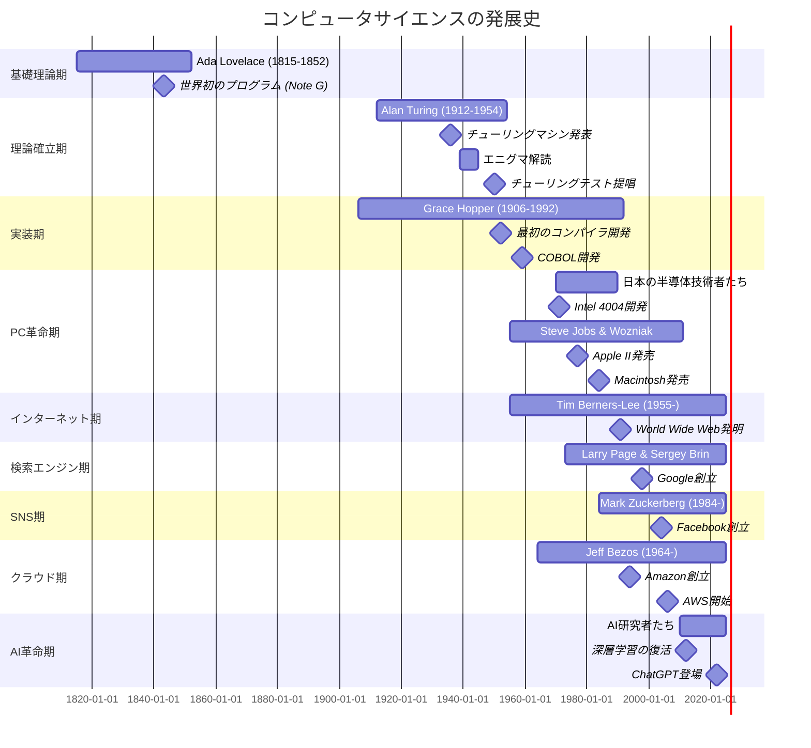
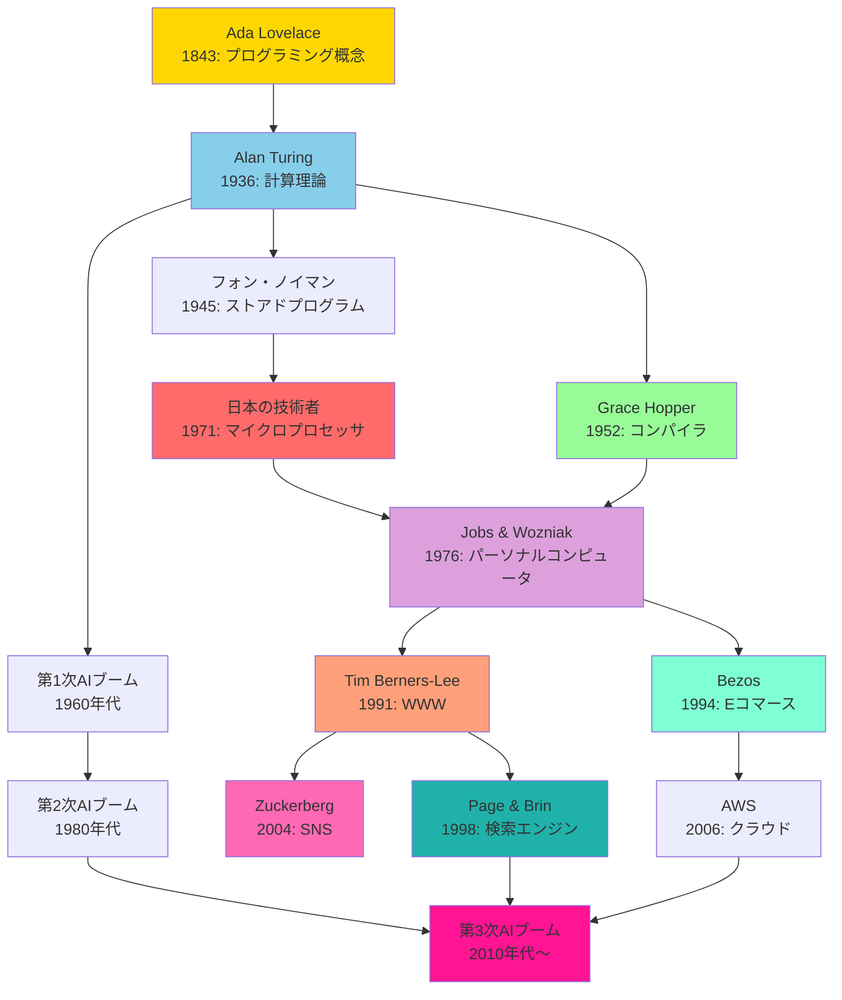
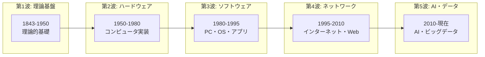
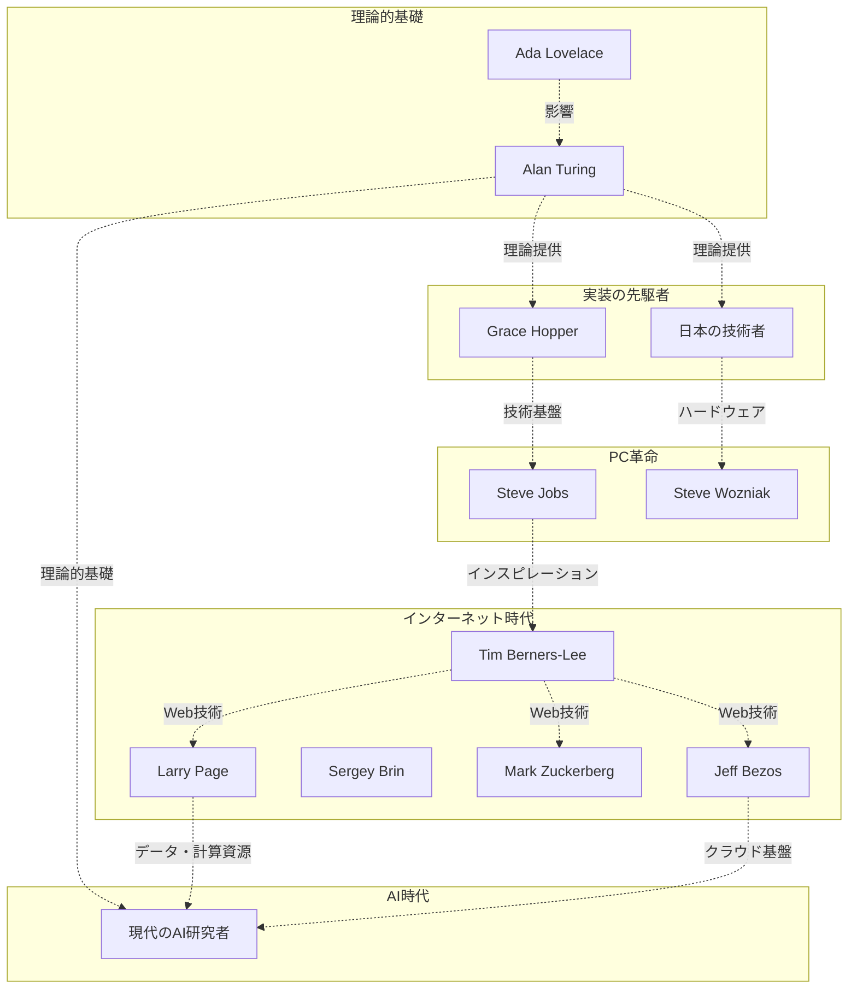

# コンピュータサイエンスの歴史年表

## 包括的タイムライン図

```mermaid
gantt
    title コンピュータサイエンスの発展史
    dateFormat YYYY
    
    section 基礎理論期
    Ada Lovelace (1815-1852)           :1815, 37y
    世界初のプログラム (Note G)        :milestone, 1843, 0
    
    section 理論確立期
    Alan Turing (1912-1954)            :1912, 42y
    チューリングマシン発表             :milestone, 1936, 0
    エニグマ解読                       :1939, 6y
    チューリングテスト提唱             :milestone, 1950, 0
    
    section 実装期
    Grace Hopper (1906-1992)           :1906, 86y
    最初のコンパイラ開発               :milestone, 1952, 0
    COBOL開発                          :milestone, 1959, 0
    
    section PC革命期
    日本の半導体技術者たち             :1970, 1990
    Intel 4004開発                     :milestone, 1971, 0
    Steve Jobs & Wozniak               :1955, 56y
    Apple II発売                       :milestone, 1977, 0
    Macintosh発売                      :milestone, 1984, 0
    
    section インターネット期
    Tim Berners-Lee (1955-)            :1955, 70y
    World Wide Web発明                 :milestone, 1991, 0
    
    section 検索エンジン期
    Larry Page & Sergey Brin           :1973, 52y
    Google創立                         :milestone, 1998, 0
    
    section SNS期
    Mark Zuckerberg (1984-)            :1984, 41y
    Facebook創立                       :milestone, 2004, 0
    
    section クラウド期
    Jeff Bezos (1964-)                 :1964, 61y
    Amazon創立                         :milestone, 1994, 0
    AWS開始                            :milestone, 2006, 0
    
    section AI革命期
    AI研究者たち                       :2010, 15y
    深層学習の復活                     :milestone, 2012, 0
    ChatGPT登場                        :milestone, 2022, 0
```

## 技術系譜図

```mermaid
graph TD
    Ada[Ada Lovelace<br/>1843: プログラミング概念] --> Turing[Alan Turing<br/>1936: 計算理論]
    Turing --> Hopper[Grace Hopper<br/>1952: コンパイラ]
    
    Turing --> VonNeumann[フォン・ノイマン<br/>1945: ストアドプログラム]
    VonNeumann --> Japan[日本の技術者<br/>1971: マイクロプロセッサ]
    
    Japan --> Apple[Jobs & Wozniak<br/>1976: パーソナルコンピュータ]
    Hopper --> Apple
    
    Apple --> Web[Tim Berners-Lee<br/>1991: WWW]
    Web --> Google[Page & Brin<br/>1998: 検索エンジン]
    Web --> Facebook[Zuckerberg<br/>2004: SNS]
    
    Apple --> Amazon[Bezos<br/>1994: Eコマース]
    Amazon --> AWS[AWS<br/>2006: クラウド]
    
    Turing --> AI1[第1次AIブーム<br/>1960年代]
    AI1 --> AI2[第2次AIブーム<br/>1980年代]
    AI2 --> AI3[第3次AIブーム<br/>2010年代〜]
    
    Google --> AI3
    AWS --> AI3
    
    style Ada fill:#ffd700
    style Turing fill:#87ceeb
    style Hopper fill:#98fb98
    style Japan fill:#ff6b6b
    style Apple fill:#dda0dd
    style Web fill:#ffa07a
    style Google fill:#20b2aa
    style Facebook fill:#ff69b4
    style Amazon fill:#7fffd4
    style AI3 fill:#ff1493
```

## 革新の波

```mermaid
graph LR
    subgraph "第1波: 理論基盤"
        Theory[1843-1950<br/>理論的基礎]
    end
    
    subgraph "第2波: ハードウェア"
        Hardware[1950-1980<br/>コンピュータ実装]
    end
    
    subgraph "第3波: ソフトウェア"
        Software[1980-1995<br/>PC・OS・アプリ]
    end
    
    subgraph "第4波: ネットワーク"
        Network[1995-2010<br/>インターネット・Web]
    end
    
    subgraph "第5波: AI・データ"
        AI[2010-現在<br/>AI・ビッグデータ]
    end
    
    Theory --> Hardware --> Software --> Network --> AI
```

## 人物相関図

```mermaid
graph TB
    subgraph "理論的基礎"
        Ada[Ada Lovelace]
        Turing[Alan Turing]
        Ada -.影響.-> Turing
    end
    
    subgraph "実装の先駆者"
        Hopper[Grace Hopper]
        Japan[日本の技術者]
        Turing -.理論提供.-> Hopper
        Turing -.理論提供.-> Japan
    end
    
    subgraph "PC革命"
        Jobs[Steve Jobs]
        Woz[Steve Wozniak]
        Hopper -.技術基盤.-> Jobs
        Japan -.ハードウェア.-> Woz
    end
    
    subgraph "インターネット時代"
        Tim[Tim Berners-Lee]
        Larry[Larry Page]
        Sergey[Sergey Brin]
        Mark[Mark Zuckerberg]
        Jeff[Jeff Bezos]
        
        Jobs -.インスピレーション.-> Tim
        Tim -.Web技術.-> Larry
        Tim -.Web技術.-> Mark
        Tim -.Web技術.-> Jeff
    end
    
    subgraph "AI時代"
        Modern[現代のAI研究者]
        Turing -.理論的基礎.-> Modern
        Larry -.データ・計算資源.-> Modern
        Jeff -.クラウド基盤.-> Modern
    end
```